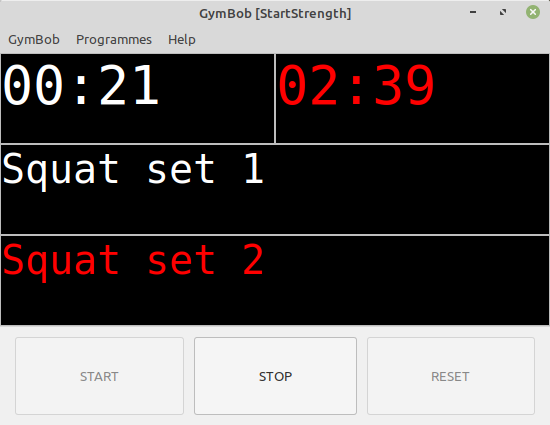

======
GymBob
======
----------------------------------------------
A simple script to prompt you during a workout
----------------------------------------------

* `1 Introduction`_
* `2 Downloads`_
* `3 Quick start guide`_
* `4 Installation`_
* `5 Using GymBob`_
* `6 Contributing`_
* `7 Authors`_
* `8 License`_

1 Introduction
==============

A typical gym workout consists of a sequence of exercises. Sometimes each exercise is performed several times. (Each repetition is called a 'set').

**GymBob** prompts the user, at pre-determined intervals, when to begin each set. The **GymBob** window shows the current set, the next set, and a stopwatch for both. If sound is enabled (which it is by default), the user will hear a sound effect when it's time to start a set.

**GymBob** follows a workout programme created by you, the user. It's easy to create your own programmes, and you can create as many as you like.

**GymBob** is written in Python 3 / Gtk 3. It runs on Linux and \*BSD. There are no plans to create installers for MS Windows and MacOS.

Problems can be reported at `our GitHub page <https://github.com/axcore/gymbob/issues>`__.

2 Downloads
===========

Latest version: **v1.002 (28 Mar 2020)**

- `DEB package (for Debian-based distros, e.g. Ubuntu, Linux Mint) <https://sourceforge.net/projects/gymbob/files/v1.002/python3-gymbob_1.002.deb/download>`__ from Sourceforge
- `RPM package (for RHEL-based distros, e.g. Fedora) <https://sourceforge.net/projects/gymbob/files/v1.002/tartube-1.002.rpm/download>`__ from Sourceforge
- `Source code <https://sourceforge.net/projects/gymbob/files/v1.002/gymbob_v1.002.tar.gz/download>`__ from Sourceforge
- `Source code <https://github.com/axcore/gymbob>`__ and `support <https://github.com/axcore/gymbob/issues>`__ from GitHub

3 Quick start guide 
===================

-  Download, install and run **GymBob**, using the links above
-  Click **Programmes > New programme...**
-  Enter a name, and click the **OK** button
-  Specify a time (in seconds), a message to display, and optionally a sound effect
-  Repeat that step as many times as you like
-  Click the **OK** button to close the window
-  Click the **START** button to start the workout programme

4 Installation
==============

Linux/BSD users can use any of the following installation methods.

4.1 Install using the DEB/RPM packages
--------------------------------------

Linux distributions based on Debian, such as Ubuntu and Linux Mint, can install **GymBob** using the DEB package (see the links above). Linux distributions based on RHEL, such as Fedora, can install **GymBob** using the RPM package (see the links above). 

4.2 Install using PyPI
----------------------

**GymBob** can be installed from `PyPI <https://pypi.org/project/gymbob/>`__ with or without root privileges.

Here is the procedure for Debian-based distributions, like Ubuntu and Linux Mint. The procedure on other distributions is probably very similar.

4.2.1 Install using PyPI (with root privileges)
~~~~~~~~~~~~~~~~~~~~~~~~~~~~~~~~~~~~~~~~~~~~~~~

1. Type: ``sudo apt install python3-pip``
2. Type: ``sudo pip3 install gymbob``
3. Type: ``gymbob``

4.2.2 Install using PyPI (without root privileges)
~~~~~~~~~~~~~~~~~~~~~~~~~~~~~~~~~~~~~~~~~~~~~~~~~~

1. Type: ``sudo apt install python3-pip``
2. Type: ``pip3 install gymbob``
3. The **GymBob** executable is stored in **~/.local/bin** by default. If that is already in your path, you can start **GymBob** by typing ``gymbob``. Otherwise, type ``~/.local/bin/gymbob``

4.3 Manual installation
-----------------------

For any other method of installation, the following dependencies are required:

-  `Python 3 <https://www.python.org/downloads>`__
-  `Gtk 3 <https://python-gtk-3-tutorial.readthedocs.io/en/latest/>`__
-  `Python playsound module <https://github.com/TaylorSMarks/playsound>`__

4.3.1 Install from source
~~~~~~~~~~~~~~~~~~~~~~~~~

After installing dependencies (see above):

1. Download & extract the source code (see the links above)
2. Change directory into the **GymBob** directory
3. Type: ``python3 setup.py install``
4. Type: ``gymbob``

4.3.2 Run without installing
~~~~~~~~~~~~~~~~~~~~~~~~~~~~

After installing dependencies (see above):

1. Download & extract the source code (see the links above)
2. Change directory into the **GymBob** directory
3. Type: ``python3 gymbob/gymbob``

5 Using GymBob
==============

5.1 Creating a programme
------------------------

The first step is to create a programme.

-  Click **Programmes > New programme...**
-  Enter a name for the programme. Each programme must have a unique name
-  Click OK to create the programme

5.2 Customising the programme
-----------------------------

Immediately after creating a programme, a new window appears. In this window you can customise the programme.

Add the first set. If you want the first set to begin immediately, do this:

- In the box marked **Time (in seconds)**, add the number 0
- In the box marked **Message**, add a message like **Squat set 1**
- If you want to add a sound effect, click the drop-down box and select one of the effects. There are twenty-five to choose from
- Click the **Add message** button

If you want the first set to begin after a delay, do this:

- In the box marked **Time (in seconds)**, add a number in seconds. For example, add 60 for a one-minute delay
- In the box marked **Message**, add a message like **Squat set 1**
- If you want to add a sound effect, click the drop-down box and select one of the effects. There are twenty-five to choose from
- Click the **Add message** button

.. image:: screenshots/gymbob2.png
  :alt: The edited workout programme

You can repeat this step as often as you like. (There is no limit to the length of a programme).
  
- In the box marked **Time (in seconds)**, add a non-zero delay
- In the box marked **Message**, add a message like **Squat set 2**
- Click the **Add message** button

5.3 Saving the programme
------------------------

At the bottom of this window you'll see four buttons.

- The **OK** button saves your changes, and closes the window
- The **Cancel** button ignores your changes, and closes the window
- The **Apply** button saves your changes, but doesn't close the window
- The **Reset** button removes your changes, and doesn't close the window

5.4 Modifying the programme
---------------------------

You can edit the current programme at any time (click **Programmes > Edit current programme...**)

If that programme is currently running (in other words, if you have clicked the **START** button), any changes you make to the programme won't be applied until after you have clicked the **RESET** button, and then the **START** button again.

In the edit window:

- You can modify any step of the programme by clicking on it, typing new values for the time, message, and/or sound effect, and clicking the **Update message** button
- You can delete a step by clicking on it, and clicking the **Delete message** button
- You can change the order of the steps by clicking on one step, and then by clicking on the **Move up** and **Move down** buttons

5.5 Deleting a programme
------------------------

You can delete a programme by clicking **Programmes > Delete programme...** 

This deletes not just the programme in memory, but the file saved on your hard drive.

Deletion is permanent, so it's a good idea to make backup copies of your programmes. **GymBob** stores its programme files in an (invisible) directory called **../.gymbob**.

5.6 Setting the current programme
---------------------------------

If you've created multiple programmes, **GymBob** will load them all into memory. The *current* programme is the one that comes first in alphabetical order.

The name of the current programme is visible in the window's title bar.

To switch to a different programme, click **Programmes > Switch programme...**

5.7 Running a programme
-----------------------

Use the **START** button to start the current programme.

Use the **STOP** button to pause the current programme, and then use the **START** button to resume it.

If you want to start the current programme again from the beginning, or if you want to switch to a different programme, first click the **RESET** button.

6 Contributing
==============

-  Report a bug: Use the Github
   `issues <https://github.com/axcore/gymbob/issues>`__ page

7 Authors
=========

See the `AUTHORS <AUTHORS>`__ file.

8 License
=========

**GymBob** is licensed under the `GNU General Public License v3.0 <https://www.gnu.org/licenses/gpl-3.0.en.html>`__.

✨🍰✨
