===================================================
Tartube - The Easy Way To Watch And Download Videos
===================================================
----------------------------------------------------------
Works with YouTube, Odysee, and hundreds of other websites
----------------------------------------------------------

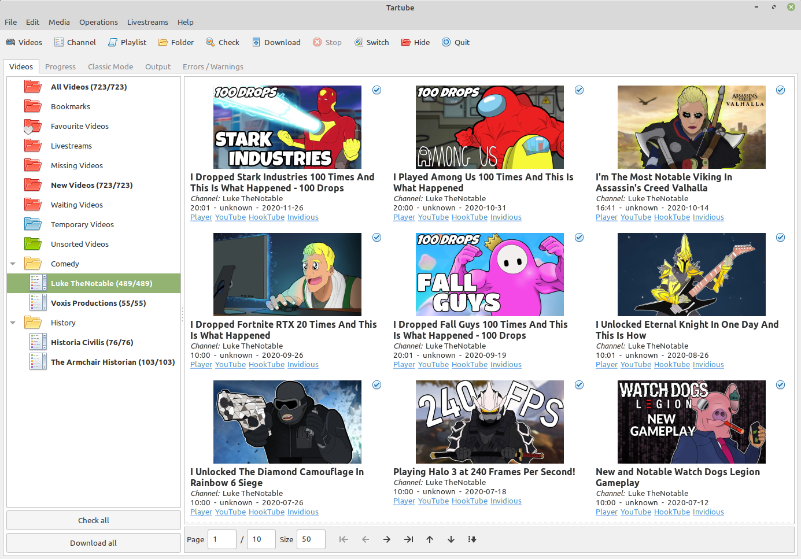

* `1 Introduction`_
* `2 Why should I use Tartube?`_
* `3 Downloads`_
* `4 Quick start guide`_
* `5 Installation`_
* `6 Using Tartube`_
* `7 Frequently-Asked Questions`_
* `8 Contributing`_
* `9 Authors`_
* `10 License`_

1 Introduction
==============

**Tartube** is a GUI front-end for `youtube-dl <https://youtube-dl.org/>`__, `yt-dlp <https://github.com/yt-dlp/yt-dlp/>`__ and other compatible video downloaders.

It is partly based on `youtube-dl-gui <https://mrs0m30n3.github.io/youtube-dl-gui/>`__ and is written in Python 3 / Gtk 3. Tartube runs on MS Windows, Linux, BSD and MacOS.

Problems can be reported at `our GitHub page <https://github.com/axcore/tartube/issues>`__.

2 Why should I use Tartube?
===========================

- You can fetch a list of videos from your favourite channels and playlists on `YouTube <https://www.youtube.com/>`__, `Odysee <https://odysee.com/>`__, and hundreds of other websites (see `here <https://ytdl-org.github.io/youtube-dl/supportedsites.html>`__ for a full list)
- If buffering is an issue, you can download a temporary copy of a video before automatically opening it in your favourite media player
- **Tartube** will organise your videos into convenient folders (if that's what you want)
- **Tartube** can alert you when livestreams and debut videos are starting (**YouTube** only)
- If creators upload their videos to more than one website (**YouTube** and **Odysee**, for example), **Tartube** can interact with both sites without creating duplicates
- Certain websites operate an "only one opinion allowed" policy. If you think that the censors will remove a video, against the wishes of its creators and before you've had a chance to watch it, **Tartube** can make an archive copy
- Certain websites frequently place restrictions on a video, not because it is unsuitable for some audiences, but for purely political reasons. Tartube can, in some circumstances, see videos that are region-blocked and/or age-restricted
- Certain websites manipulate search results, repeatedly unsubscribe people from their favourite channels and/or deliberately conceal videos that they don't like. **Tartube** won't do any of those things
- If you want to listen to your favourite discussion videos, for example while driving a car, **Tartube** can make an archive copy of just the audio, rather than the full video
- **Tartube** is free and open-source software

2.1 What's new in version 2.3.0
-------------------------------

- When you first start Tartube, you will see a new, friendly setup window, allowing you to choose basic settings, and (for most users) to download some dependencies (see `6.1 Setting up Tartube`_)
- Videos can now be displayed in a grid. This is the default mode for new installations. Existing users can click the **Switch** button near the top of the main window until they see the layout they prefer
- Livestream detection has been improved. You can now see the approximate start time of a livestream. Pre-recorded videos, which are released at a pre-determined time as if they were livestreams, are now shown in a different colour
- You can now create as many scheduled downloads as you like (earlier versions resticted you to just three; see `6.12 Scheduled downloads`_)
- **Tartube** includes a new GUI for processing videos and thumbnails with FFmpeg, replacing the simple dialogue window in the previous release (see `6.25.2 Using FFmpeg directly`_)
- You can now create as many sets of download options as you like, and as many sets of FFmpeg options as you like. They can now imported and exported between databases (see `6.11.3 Managing download options`_)
- The new **Hide** button at the top of the main window is a convenient way to hide system folders you don't need
- **Tartube** now supports `Youtube Stream Capture <https://github.com/mrwnwttk/youtube_stream_capture>`__, which can be used to download a livestream while it is broadcasting. This feature is **experimental**. It only works on **YouTube**. It doesn't work on MS Windows. It can't download continuous 24/7 livestreams. It might not be able to download some other livestreams. The feature is disabled by default. If you want to try it, see see `6.23.5 Youtube Stream Capture`_

For a full list of new features and fixes, see `recent changes <CHANGES>`__.

3 Downloads
===========

Latest version: **v2.3.332 (8 Aug 2021)**

Official packages (also available from the `Github release page <https://github.com/axcore/tartube/releases>`__):

- `MS Windows (64-bit) installer <https://sourceforge.net/projects/tartube/files/v2.3.332/install-tartube-2.3.332-64bit.exe/download>`__ and `portable edition <https://sourceforge.net/projects/tartube/files/v2.3.332/tartube-2.3.332-64bit-portable.zip/download>`__ from Sourceforge
- `MS Windows (32-bit) installer <https://sourceforge.net/projects/tartube/files/v2.3.332/install-tartube-2.3.332-32bit.exe/download>`__ and `portable edition <https://sourceforge.net/projects/tartube/files/v2.3.332/tartube-2.3.332-32bit-portable/download>`__ from Sourceforge (but see `7.23 Doesn't work on 32-bit Windows`_)
- `DEB package (for Debian-based distros, e.g. Ubuntu, Linux Mint) <https://sourceforge.net/projects/tartube/files/v2.3.332/python3-tartube_2.3.332.deb/download>`__ from Sourceforge
- `RPM package (for RHEL-based distros, e.g. Fedora) <https://sourceforge.net/projects/tartube/files/v2.3.332/tartube-2.3.332.rpm/download>`__ from Sourceforge

There are also some DEB/RPM packages marked STRICT. In these packages, updates to **youtube-dl** from within **Tartube** have been disabled. If **Tartube** is uploaded to a repository with lots of rules, such as the official Debian repository, then you should probably use the STRICT packages.

Semi-official packages:

- `Gentoo ebuild (available in src_prepare-overlay) <https://gitlab.com/src_prepare/src_prepare-overlay/>`__ from Gitlab
- `Arch AUR package <https://aur.archlinux.org/packages/tartube/>`__

Source code:

- `Source code <https://sourceforge.net/projects/tartube/files/v2.3.008/tartube_v2.3.008.tar.gz/download>`__ from Sourceforge
- `Source code <https://github.com/axcore/tartube>`__ and `support <https://github.com/axcore/tartube/issues>`__ from GitHub
- In case this Github repository is taken down, there is an official backup `here <https://gitlab.com/axcore/tartube>`__

4 Quick start guide
===================

- Install **Tartube**, using any of the methods described below
- Start **Tartube**. A setup window should appear
- When prompted, choose a folder in which **Tartube** can store videos
- When prompted, choose a downloader
- On some systems, you will be prompted to install the downloader and/or `FFmpeg <https://ffmpeg.org/>`__. On other operating systems, you will have to install them yourself

Tartube can store its videos in a database. If that's what you want, do this:

- Go to a `video website <https://www.youtube.com/>`__, and find your favourite channel
- In **Tartube**'s main window, click the **Add a new channel** button (or from the menu, click **Media > Add channel...** )
- In the dialogue window, add the name of the channel and a link to it (URL)
- Click the **OK** button to close the window
- Click the **Check all** button. **Tartube** will fetch a list of videos in the channel
- Click **All Videos** to see that list
- If you want to download the videos, click the **Download all** button

If you just want to download videos with a minimum of fuss, do this:

- Go to a `video website <https://www.youtube.com/>`__, and find your favourite channel
- In **Tartube**'s main window, click the **Classic Mode** tab
- Copy the link to the channel (URL) into the box at the top of tab
- Just below that, click the button to select a download destination and a video/audio format
- Click the **Add URLs** button
- When you're ready, click the **Download all** button

5 Installation
==============

5.1 Installation - MS Windows
-----------------------------

MS Windows users should use the installer `available at the Tartube website <https://tartube.sourceforge.io/>`__. The installer contains everything you need to run **Tartube**. You must be using Windows Vista or above; the installer will not work on Windows XP.

There is also a portable edition; use this if you want to install **Tartube** onto removable media, such as a USB drive. Download the ZIP file, extract it, and run the file **tartube_portable_64bit.bat** or **tartube_portable_32bit.bat**.

Both the installer and the portable edition include a copy of `AtomicParsley <https://bitbucket.org/jonhedgerows/atomicparsley/wiki/Home>`__, so there is no need to install it yourself.

5.1.1 Manual installation - MS Windows
~~~~~~~~~~~~~~~~~~~~~~~~~~~~~~~~~~~~~~

If you want to perform a manual installation, you can follow this procedure, which will take about 10-30 minutes, depending on your network speed.

- This section assumes you have a 64-bit computer
- Download and install MSYS2 from `msys2.org <https://msys2.org>`__. You need the file that looks something like **msys2-x86_64-yyyymmdd.exe**
- MSYS2 wants to install in **C:\\msys64**, so do that
- Open the MINGW64 terminal, which is **C:\\msys64\\mingw64.exe**
- In the MINGW64 terminal, type:

        **pacman -Syu**

- If the terminal wants to shut down, close it, and then restart it
- Now type the following commands, one by one:

        **pacman -Su**

        **pacman -S mingw-w64-x86_64-python3**

        **pacman -S mingw-w64-x86_64-python3-pip**

        **pacman -S mingw-w64-x86_64-python3-gobject**

        **pacman -S mingw-w64-x86_64-python3-requests**

        **pacman -S mingw-w64-x86_64-gtk3**

        **pacman -S mingw-w64-x86_64-gsettings-desktop-schemas**

        **pip3 install feedparser**

        **pip3 install playsound**

        **pacman -S mingw-w64-x86_64-aria2**

        **pacman -S mingw-w64-x86_64-python-matplotlib**

- Download the **Tartube** source code from Sourceforge, using the links above
- Extract it into the folder **C:\\msys64\\home\\YOURNAME**, creating a folder called **C:\\msys64\\home\\YOURNAME\\tartube**
- Now, to run **Tartube**, type these commands in the MINGW64 terminal (don't forget to use *forward* slashes):

        **cd /home/YOURNAME/tartube**

        **python3 tartube/tartube**

5.2 Installation - MacOS
------------------------

MacOS users should use the following procedure (with thanks to JeremyShih):

- Install `Python 3 <https://www.python.org/downloads>`__ by downloading an installer, or with homebrew:

        **brew install pkg-config**

        **brew install python**

- Install `Gtk 3 <https://python-gtk-3-tutorial.readthedocs.io/en/latest/>`__

        **pip install pycairo**

        **brew install gobject-introspection**

        **python3 -m pip install PyGObject**

        **brew install gtk+3**

- Install `Python Requests module <https://3.python-requests.org/>`__

        **pip install requests**

- Install either `youtube-dl <https://youtube-dl.org/>`__ or `yt-dlp <https://github.com/yt-dlp/yt-dlp/>`__

        **pip install youtube-dl**

        **pip install yt-dlp**

- Install the Adwaita theme for icons used by Tartube (optional)

        **brew install adwaita-icon-theme**

- It is strongly recommended that you install `FFmpeg <https://ffmpeg.org/>`__, too

        **brew install ffmpeg**

After installing dependencies (see above):

1. Download & extract the source code (see the links above)
2. Change directory into the **Tartube** directory
3. Type: ``python3 tartube/tartube``

5.3 Installation - Linux/BSD
----------------------------

Linux/BSD users can use any of the following installation methods.

5.3.1 Install using the DEB package
~~~~~~~~~~~~~~~~~~~~~~~~~~~~~~~~~~~

Linux distributions based on Debian, such as Ubuntu and Linux Mint, can install **Tartube** using the DEB package (see the links above).

**Tartube** requires either `youtube-dl <https://youtube-dl.org/>`__ or `yt-dlp <https://github.com/yt-dlp/yt-dlp/>`__. If it's already installed on your system, then you can start **Tartube** immediately. Otherwise, do this:

1. Run **Tartube**
2. **Tartube** asks you to choose a data directory, so do that
3. Click **Operations > Update youtube-dl**

It is strongly recommended that you install `FFmpeg <https://ffmpeg.org/>`__, too. On most Debian-based systems, you can open a terminal window and run this command:

        **sudo apt-get install ffmpeg**

5.3.2 Install using the RPM package
~~~~~~~~~~~~~~~~~~~~~~~~~~~~~~~~~~~

Linux distributions based on RHEL, such as Fedora, can install **Tartube** using the RPM package (see the links above).

**Tartube** requires either `youtube-dl <https://youtube-dl.org/>`__ or `yt-dlp <https://github.com/yt-dlp/yt-dlp/>`__. If it's already installed on your system, then you can start **Tartube** immediately. Otherwise, do this:

Otherwise, if **pip** is already installed on your system, do this:

1. Run **Tartube**
2. **Tartube** asks you to choose a data directory, so do that
3. Click **Operations > Update youtube-dl**

If neither **youtube-dl** nor **pip** are installed on your system, then the recommended way to install **youtube-dl** is from the command line, using **pip**. (Software managers usually don't offer the most recent version of **youtube-dl**.)

On Fedora, the procedure is:

1. Open a terminal window
2. Type: ``dnf -y install python3-pip``
3. Type: ``pip3 install youtube-dl`` or ``pip3 install yt-dlp``
4. You can now run **Tartube**.

It is strongly recommended that you install `FFmpeg <https://ffmpeg.org/>`__, too. On most RHEL-based systems (for example, Fedora 29-32), you can open a terminal window and run these commands:

        **sudo dnf -y install https://download1.rpmfusion.org/free/fedora/rpmfusion-free-release-$(rpm -E %fedora).noarch.rpm**

        **sudo dnf -y install https://download1.rpmfusion.org/nonfree/fedora/rpmfusion-nonfree-release-$(rpm -E %fedora).noarch.rpm**

        **sudo apt-get install ffmpeg**

5.3.3 Install using the AUR package
~~~~~~~~~~~~~~~~~~~~~~~~~~~~~~~~~~~

On Arch-based systems. such as Manjaro, Tartube can be installed using the semi-official AUR package. The procedure is:

1. Open a terminal window
2. Type: ``git clone https://aur.archlinux.org/tartube.git``
3. Type: ``cd tartube``
4. Type: ``makepkg -si``
5. You can now run **Tartube**.

It is strongly recommended that you install `FFmpeg <https://ffmpeg.org/>`__, too. On most Arch-based systems, you can open a terminal window and run this command:

        **sudo pacman -S ffmpeg**

5.3.4 Install using the ebuild package
~~~~~~~~~~~~~~~~~~~~~~~~~~~~~~~~~~~~~~

On Gentoo-based systems, **Tartube** can be installed using the semi-official ebuild package, using the link above.

Tartube requires `youtube-dl <https://youtube-dl.org/>`__. It is strongly recommended that you install `FFmpeg <https://ffmpeg.org/>`__, too.

If you're not sure how to install using ebuild, then it might be easier to install from PyPI.

5.3.5 Install using PyPI
~~~~~~~~~~~~~~~~~~~~~~~~

**Tartube** can be installed from `PyPI <https://pypi.org/project/tartube/>`__ with or without root privileges.

Here is the procedure for Debian-based distributions, like Ubuntu and Linux Mint. The procedure on other distributions is probably very similar.

5.3.6 Install using PyPI (with root privileges)
~~~~~~~~~~~~~~~~~~~~~~~~~~~~~~~~~~~~~~~~~~~~~~~

1. Make sure **youtube-dl** has been completely removed from your system
2. Type: ``sudo apt install python3-pip``
3. Type: ``sudo pip3 install youtube-dl tartube`` or ``sudo pip3 install yt-dlp tartube``
4. Type: ``tartube``

5.3.7 Install using PyPI (without root privileges)
~~~~~~~~~~~~~~~~~~~~~~~~~~~~~~~~~~~~~~~~~~~~~~~~~~

1. Type: ``sudo apt install python3-pip``
2. Type: ``pip3 install tartube``
3. The **Tartube** executable is stored in ``~/.local/bin`` by default. If that is already in your path, you can start **Tartube** by typing ``tartube``. Otherwise, type ``~/.local/bin/tartube``
4. **Tartube** asks you to choose a data directory, so do that
5. In the **Tartube** main window, click **Edit > System preferences... > youtube-dl**
6. In the box marked **Path to youtube-dl executable**, select **Use PyPI path (\~/.local/bin/youtube-dl)**
7. Click **OK** to close the dialogue window
8. Click **Operations > Update youtube-dl**
9. Once the update has finished, **Tartube** is ready for use

5.3.8 Manual installation
~~~~~~~~~~~~~~~~~~~~~~~~~

For any other method of installation on Linux/BSD, the following dependencies are required:

-  `Python 3 <https://www.python.org/downloads>`__
-  `Gtk 3 <https://python-gtk-3-tutorial.readthedocs.io/en/latest/>`__
-  `Python Requests module <https://3.python-requests.org/>`__
-  Either `youtube-dl <https://youtube-dl.org/>`__ or `yt-dlp <https://github.com/yt-dlp/yt-dlp/>`__

These dependencies are optional, but recommended:

-  `Python pip <https://pypi.org/project/pip/>`__ - keeping youtube-dl up to date is much simpler when pip is installed
-  `Python feedparser module <https://pypi.org/project/feedparser/>`__ - enables **Tartube** to detect livestreams
-  `Python moviepy module <https://pypi.org/project/moviepy/>`__ - if the website doesn't tell **Tartube** about the length of its videos, moviepy can work it out
-  `Python playsound module <https://pypi.org/project/playsound/>`__ - enables **Tartube** to play an alarm when a livestream starts
-  `FFmpeg <https://ffmpeg.org/>`__ - required for various video post-processing tasks; see the section below if you want to use FFmpeg
-  `AtomicParsley <https://bitbucket.org/wez/atomicparsley/src/default/>`__ - required for embedding thumbnails in audio files
-  `aria2 <https://aria2.github.io/>`__ - required for Youtube Stream Capture
-  `matplotlib <https://matplotlib.org/>`__ - required for drawing graphs

5.3.9 Install from source
~~~~~~~~~~~~~~~~~~~~~~~~~

After installing dependencies (see above):

1. Download & extract the source code (see the links above)
2. Change directory into the **Tartube** directory
3. Type: ``python3 setup.py install``
4. Type: ``tartube``

5.3.10 Run without installing
~~~~~~~~~~~~~~~~~~~~~~~~~~~~~

After installing dependencies (see above):

1. Download & extract the source code (see the links above)
2. Change directory into the **Tartube** directory
3. Type: ``python3 tartube/tartube``

5.4 Packaging Tartube
---------------------

Tartube packages are usually created using one of the available environment variables:

- **TARTUBE_PKG** for packages without restrictions
- **TARTUBE_PKG_STRICT** for a package which should not download or update **youtube-dl** or **FFmpeg**; the user is required to install those packages separately
- **TARTUBE_PKG_NO_DOWNLOAD** for a package which should not download any videos (and also will not download/update **youtube-dl** or **FFmpeg**)

Some packaging systems might forbid installing other packages. If that's the case, you can disable that functionality.

Anyone with concerns over the legality of downloading videos can disable that feature altogether. Tartube will still be able to check videos, channels and playlists, as well as monitor livestreams. Users can watch a video on its original website with a single click. The authors understand that the US courts have ruled that 'scraping' a website is legal. Popular sites like **YouTube** provide RSS feeds for this very purpose.

Packages can be created in the standard way. For example, an RPM package would be created with the command:

        **TARTUBE_PKG=1 python3 setup.py bdist_rpm**

5.4.1 Packaging Tartube on MS Windows
~~~~~~~~~~~~~~~~~~~~~~~~~~~~~~~~~~~~~

The procedure used to create the MS Windows installers is described in full in the
`installer scripts themselves <nsis/tatrube_install_64bit.nsi>`__.

6 Using Tartube
===============

* `6.1 Setting up Tartube`_
* `6.2 Updating the downloader`_
* `6.3 Setting the downloader's location`_
* `6.4 Installing FFmpeg / AVConv`_
* `6.4.1 On MS Windows`_
* `6.4.2 On Linux/BSD/MacOS`_
* `6.5 Introducing system folders`_
* `6.6 Adding videos`_
* `6.7 Adding channels and playlists`_
* `6.8 Adding videos, channels and playlists together`_
* `6.8.1 Bulk-adding channels and playlists`_
* `6.8.2 Updating adding channels and playlists`_
* `6.9 Adding folders`_
* `6.10 Things you can do`_
* `6.11 Download options`_
* `6.11.1 Advanced download options`_
* `6.11.2 Other download options`_
* `6.11.3 Managing download options`_
* `6.11.4 Download options for yt-dlp`_
* `6.12 Scheduled downloads`_
* `6.13 Custom downloads`_
* `6.13.1 Creating custom downloads`_
* `6.13.2 Independent downloads`_
* `6.13.3 Diverting to HookTube / Invidious`_
* `6.13.4 Delays between downloads`_
* `6.13.5 Splitting and slicing videos`_
* `6.13.6 Launching custom downloads`_
* `6.14 Watching videos`_
* `6.15 Filtering and finding videos`_
* `6.16 Marking videos`_
* `6.16.1 Bookmarked videos`_
* `6.16.2 Favourite channels, playlists and folders`_
* `6.17 Combining channels, playlists and folders`_
* `6.17.1 Combining one channel and many playlists`_
* `6.17.2 Combining channels from different websites`_
* `6.17.3 Download all videos to a single folder`_
* `6.17.4 Download all videos to an external folder`_
* `6.17.5 External folders and yt-dlp`_
* `6.18 Archiving videos`_
* `6.19 Performance limits`_
* `6.20 Managing databases`_
* `6.20.1 Importing videos from other applications`_
* `6.20.2 Multiple databases`_
* `6.20.3 Multiple Tartubes`_
* `6.20.4 Exporting/importing the database`_
* `6.21 Converting to audio`_
* `6.22 Classic Mode`_
* `6.22.1 Customising Classic Mode`_
* `6.23 Livestreams`_
* `6.23.1 Detecting livestreams`_
* `6.23.2 Customising livestreams`_
* `6.23.3 Livestream notifications`_
* `6.23.4 Compatible websites`_
* `6.24 Detecting missing videos`_
* `6.25 More information about FFmpeg and AVConv`_
* `6.25.1 Using FFmpeg / AVConv with youtube-dl`_
* `6.25.2 Using FFmpeg directly`_
* `6.25.3 Using FFmpeg options`_
* `6.25.4 Advanced FFmpeg options`_
* `6.26 Video clips`_
* `6.26.1 Video clip preferences`_
* `6.26.2 Quick video clips`_
* `6.26.3 Downloading video clips`_
* `6.26.4 Extracting video clips`_
* `6.26.5 Video clip shortcuts`_
* `6.27 Video slices`_
* `6.27.1 Video slice preferences`_
* `6.27.2 Quick video slices`_
* `6.27.3 Downloading sliced videos`_
* `6.27.4 Removing video slices`_
* `6.27.5 Video slice shortcuts`_
* `6.28 Using youtube-dl forks`_
* `6.29 Video Comments`_

6.1 Setting up Tartube
----------------------

When you first start **Tartube**, you will be asked to choose a few settings.

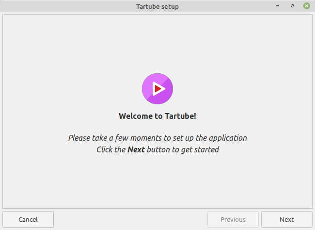

Most users can use this window to download and install some packages. If not, those packages must be installed separately.

All of these settings can be changed later, if you want. For example, to change where **Tartube** stores its files, see `6.20 Managing databases`_.

6.2 Updating the downloader
---------------------------

*If you installed Tartube via a repository such as the official Debian repository, then Tartube may not be allowed to update youtube-dl. In that case, this section does not apply; update youtube-dl using your system's package manager.*

**Tartube** uses a downloader to interact with websites like **YouTube**. **Tartube** officially supports two downloaders,
`youtube-dl <https://youtube-dl.org/>`__ and `yt-dlp <https://github.com/yt-dlp/yt-dlp/>`__. (Other forks of **youtube-dl** will probably work as well.)

Websites changes their code frequently, and therefore the downloaders must be updated frequently.

- Click **Operations > Update youtube-dl**
- The name will be different if you're using a different downloader

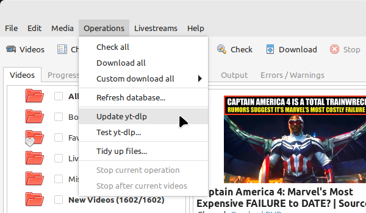

6.3 Setting the downloader's location
--------------------------------------

If the update operation fails on MS Windows, you should `ask the authors for help <https://github.com/axcore/tartube/>`__.

On other systems, users can modify **Tartube**'s settings. There are several locations on your filesystem where **youtube-dl** might have been installed.

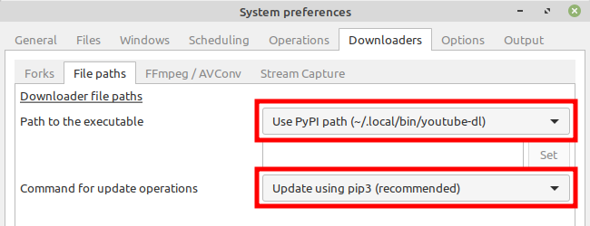

- Click **Edit > System preferences... > Downloaders > File paths**
- Try changing the setting **Path to executable**
- Try changing the setting **Command for update operations**
- Try the update operation again

6.4 Installing FFmpeg / AVConv
------------------------------

`FFmpeg <https://ffmpeg.org/>`__ and `AVConv <https://sourceforge.io/projects/avconv/>`__ are commonly use for various video-processing tasks.

**It is strongly recommended that all users install FFmpeg**. Without it, Tartube won't be able to do any of these things:

- Display thumbnails from **YouTube**
- Download high-resolution videos from any website
- Download certain other video formats
- Convert video files to audio

**youtube-dl** uses FFmpeg by default, but it can use AVConv for certain tasks.

For more information about **Tartube**'s use of FFmpeg and AVConv, see `6.25 More information about FFmpeg and AVConv`_.

6.4.1 On MS Windows
~~~~~~~~~~~~~~~~~~~

On MS Windows, the usual methods of FFmpeg installation will not work. You **must** download an MSYS2-compatible version of FFmpeg. This can be done in the setup window, or from **Tartube**'s main menu: click **Operations > Install FFmpeg...**.

There is no known method of installing a compatible version of AVConv.

6.4.2 On Linux/BSD/MacOS
~~~~~~~~~~~~~~~~~~~~~~~~

On all other operating systems, **Tartube** and **youtube-dl** should be able to use **FFmpeg** (and **AVConv**, if it is also installed) without any help from you.

If the **FFmpeg** / **AVConv** executables have been installed to an unusual location, you can tell **Tartube** where to find them.

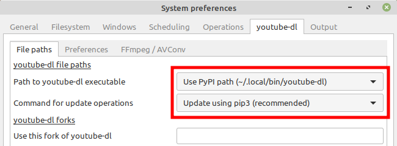

- Click **Edit > System preferences... > Downloaders > FFmpeg / AVConv**
- Click the **Set** buttons and select the **FFmpeg** or **AVConv** executable
- Click the **Reset** buttons to remove that selection
- Click the the **Use default path** buttons to use the normal location for each executable

6.5 Introducing system folders
------------------------------

On the left side of the **Tartube** window is a list of folders. You can store videos, channels and playlists inside these folders. You can even store folders inside of other folders.

**Tartube** saves videos on your filesystem using exactly the same structure.

When you start **Tartube** for the first time, there are several folders already visible. You can't remove any of these folders (but you can hide them, if you want).

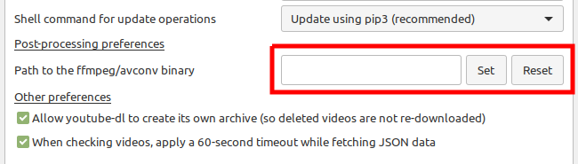

- The **All Videos** folder shows every video in **Tartube**'s database, whether it has been downloaded or not
- The **Bookmarks** folder shows videos you've bookmarked, because they're interesting or important (see `6.16.1 Bookmarked videos`_ )
- The **Favourite Videos** folder shows videos in a channel, playlist or folder that you've marked as favourite videos (see `6.16.2 Favourite channels, playlists and folders`_ )
- The **Livestreams** folder shows livestreams. Videos are automatically removed from this folder (but not from other folders) when the livestream is finished
- The **Missing videos** folder (see `6.24 Detecting missing videos`_ ) shows videos that you've downloaded, but which have since been removed from the website by their creator
- The **New Videos** folder shows videos that have been downloaded, but not yet watched
- The **Recent Videos** folder shows videos that were checked or downloaded, the last time you used **youtube-dl** (to change this behaviour, right-click the folder and select **Downloads > Set removal time...**)
- The **Waiting Videos** folder shows videos that you want to watch soon. When you watch the video, it's automatically removed from the folder (but not from **Tartube**'s database)
- Videos saved to the **Temporary Videos** folder will be deleted when **Tartube** next starts
- The **Unsorted Videos** folder is a useful place to put videos that don't belong to a particular channel or playlist
- The **Video Clips** folder is a useful place to put video clips  (see `6.26 Video clips`_)

6.6 Adding videos
-----------------

*If you want a simpler way to download videos, see* `6.22 Classic Mode`_.

You can add individual videos by clicking the **Add new video(s)** button near the top of the window. A dialogue window will appear.

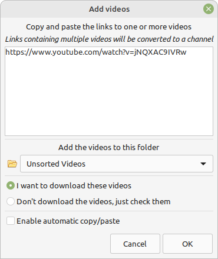

Copy and paste the video's URL into the dialogue window. You can copy and paste as many URLs as you like.

When you're finished, click the **OK** button.

Finally, click on the **Unsorted Videos** folder to see the videos you've added.

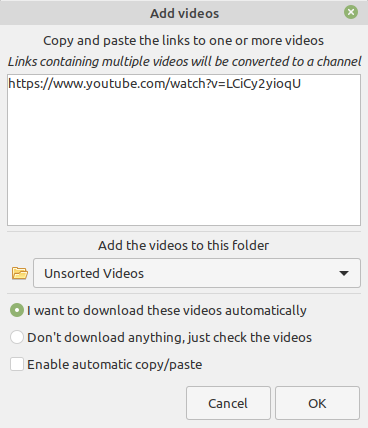

6.7 Adding channels and playlists
---------------------------------

You can also add a whole channel by clicking the **Add a new channel** button or a whole playlist by clicking the **Add a new playlist** button.

**Tartube** will download all of the videos in the channel or playlist.

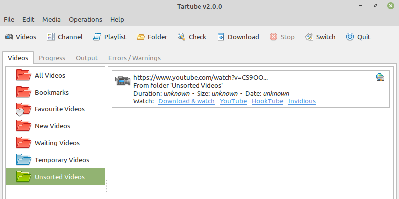

Copy and paste the channel's URL into the dialogue window. You should also give the channel a name. The channel's name is usually the name used on the website (but you can choose any name you like).

6.8 Adding videos, channels and playlists together
--------------------------------------------------

When adding a long list of URLs, containing a mixture of channels, playlists and individual videos, it's quicker to add them all at the same time. Click the **Add new video(s)** button near the top of the window, and paste all the links into the dialogue window.

**Tartube** doesn't know anything about these links until you actually download them (or check them). If it's expecting an individual video, but receives a channel or a playlist, **Tartube** will the handle the conversion for you.

By default, **Tartube** converts a link into a channel, when necessary. You can change this behaviour, if you want to.

- In **Tartube**'s main window, click **Edit > System preferences... > Operations > Preferences**
- Select one of the buttons under **URL flexibility preferences**

Unfortunately, there is no way for **Tartube** to distinguish a channel from a playlist. Most video websites don't supply that information.

If your list of URLs contains a mixture of channels and playlists, you can convert one to the other after the download has finished.

- In **Tartube**'s main window, right-click a channel, and select **Channel actions > Convert to playlist**
- Alternatively, right-click a playlist, and select **Playlist actions > Convert to channel**
- After converting, you can set a name for the new channel/playlist by right-clicking it, and selecting **Channel actions > Rename channel...** or **Playlist actions > Rename playlist...**

6.8.1 Bulk-adding channels and playlists
~~~~~~~~~~~~~~~~~~~~~~~~~~~~~~~~~~~~~~~~

However, if you're confident that your long list of URLs contains only channels and playlists, there are a couple of other ways to add them.

Firstly, you can click **Media > Add many channels/playlists...**.

Secondly, you could import a text file contaiing a list of channels/playlists. You can write the text file yourself. Each channel/playlist is defined by three consecutive lines, in the following format:

        @channel

        Alice's Channel

        <url>

        @playlist

        Bob's Playlist

        <url>

... where **<url>** is the web address of the channel/playlist. (Leave out the diamond brackets.)

When you're ready, click **Media > Import into database > Plain text export file...**

6.8.2 Updating adding channels and playlists
~~~~~~~~~~~~~~~~~~~~~~~~~~~~~~~~~~~~~~~~~~~~

If you need to update *existing* channels and playlists, you can do so by clicking **Edit > System preferences... > Files > URLs**.

6.9 Adding folders
------------------

The left-hand side of the window will quickly still filling up. It's a good idea to create some folders, and to store your channels/playlists inside those folders.

Click the **Add a new folder** button near the top of the window,  and create a folder called **Comedy**.

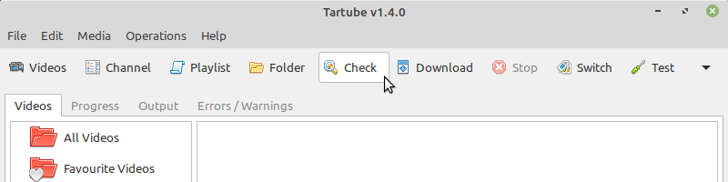

Then repeat that process to create a folder called **History**. You can then drag-and-drop your channels and playlists into those folders.

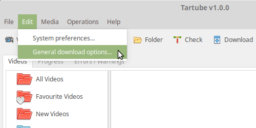

6.10 Things you can do
----------------------

Once you've finished adding videos, channels, playlists and folders, you can make **Tartube** do something. **Tartube** offers the following operations:

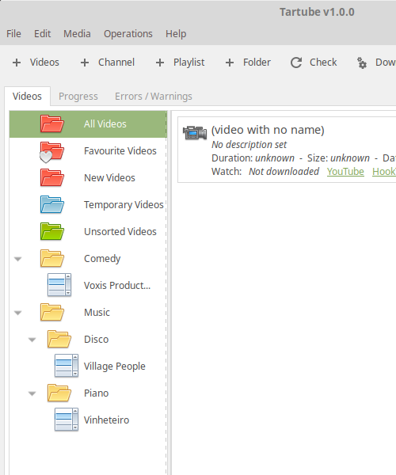

Checking/download videos:

- **Check** - Fetches information about videos, but doesn't download them
- **Download** - Actually downloads the videos. If you have disabled downloads for a particular item, **Tartube** will just fetch information about it instead
- **Custom download** - Downloads videos in a non-standard way; see `6.13 Custom downloads`_
- To **Check** or **Download** videos, channels and playlists, use the main menu, or the buttons near the top of the window, or the buttons in the bottom-left corner, or right-click an individual video, channel or playlist
- A **Custom Download** can be started from the main menu (**Operations > Custom download all** or by right-clicking a video, channel, playlist or folder

Refreshing the filesystem:

- **Refresh** - Examines your filesystem. If you have manually copied any videos to the location in which **Tartube** stores its files, those videos are added to **Tartube**'s database
- To **Refresh** **Tartube**'s database, use the main menu (**Operations > Refresh database...**) or right-click a channel/playlist/folder
- *Protip*: Do a **'Check'** operation before you do **'Refresh'** operation

Updating packages:

- **Update** - Installs or updates **youtube-dl**, as described in `6.2 Updating the downloader`_. Also installs FFmpeg (on MS Windows only); see `6.4 Installing FFmpeg / AVConv`_
- *Protip*: Do an **'Update'** operation before you do a **'Check'** or **'Download'** operation

Fetching information:

- **Info** - Fetches information about a particular video: either the available video/audio formats, or the available subtitles
- To fetch **Info** about a video, right-click it and select **Fetch**

Tidying up the filesytem:

- **Tidy** - Tidies up **Tartube**'s data directory (folder), as well as checking that downloaded videos still exist and are not corrupted
- To **Tidy** the data directory, use the main menu (**Operations > Tidy up files...** or right-click a channel/playlist/folder

Dealing with livestreams:

- **Livestream** - Checks whether any livestreams have started (or stopped), without fetching the full list of videos
- **Livestream capture** - When available, downloads a livestream that's broadcasting now; see `6.23.5 Youtube Stream Capture`_
- A **Livestream** check happens every few minutes (if **Tartube** detected livestreams during a **Check** or a **Download**). To force a check now, click **Livestreams > Update existing livestreams**

Processing videos with **FFmpeg**:

- **Process** - Processes videos and thumbnails with FFmpeg - see `6.25 More information about FFmpeg and AVConv`_
- To process video(s) and/or their thumbnails, right-click a video and select **Special > Process with FFmpeg...**

6.11 Download options
---------------------

**youtube-dl** offers a large number of download options. This is how to set them.

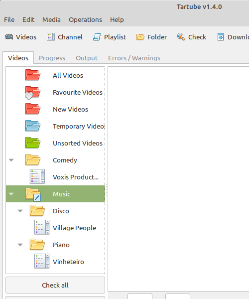

-  Click **Edit > General download options...**

A new window opens. Any changes you make in this window aren't actually applied until you click the **'Apply'** or **'OK'** buttons.

6.11.1 Advanced download options
~~~~~~~~~~~~~~~~~~~~~~~~~~~~~~~~

Some of the options are intended for advanced users, so they're hidden by default. To revel them, click the button **Show advanced download options**.

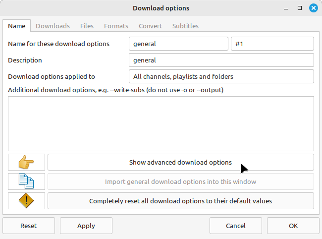

After clicking the button, some new tabs will appear. The existing tabs will also have some new features.

6.11.2 Other download options
~~~~~~~~~~~~~~~~~~~~~~~~~~~~~

When you click **Edit > General download options...**, you are seeing the *default* download options. If you want to apply a *different* set of download options to a particular channel or particular playlist, you can do so.

At the moment, the general download options apply to *all* the videos, channels, playlists and folders you've added.

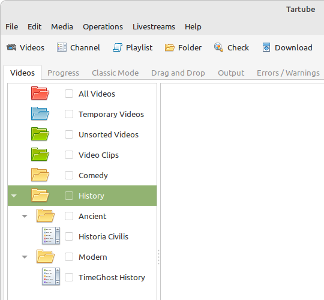

Now, suppose you want to apply some download options to the **History** folder:

-  Right-click the folder, and select **Apply download options...**

In the new window, select **Create new download options**, and then click the **OK** button. A second window will appear, so you can click the **OK** button there, too.

The new options are applied to *everything* in the **History folder**. A pen icon appears above the folder to remind you of this.

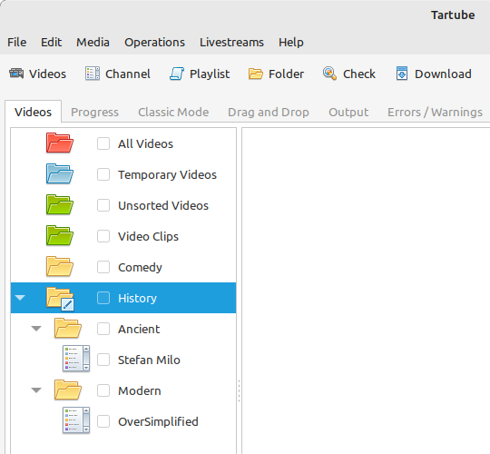

Now, suppose you want to add a *different* set of download options, but only for the channel **The Armchair Historian**.

-  Right-click the channel, and select **Apply download options...**
-  In the new windows, click the **OK** button

The previous set of download options still applies to everything in the **History** folder, *except* the channel **The Armchair Historian**.

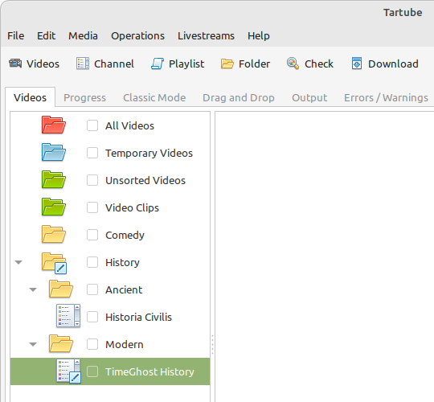

6.11.3 Managing download options
--------------------------------

In fact, you can create as many sets of download options as you like.

- Click **Edit > System preferences... > Options > Download options**

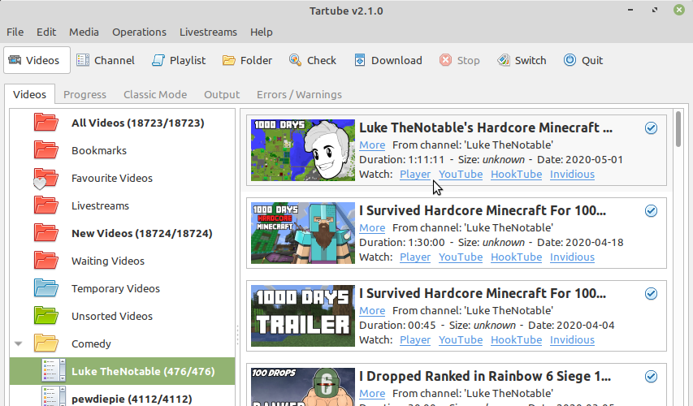

The first item in the list, **general**, is the default set of download options. The second item, **classic**, are the download options that apply in the **Classic Mode** tab (see `6.22 Classic Mode`_).

Download options are saved in the Tartube database, so if you switch databases (see `6.20.2 Multiple databases`_), a different selection of download options will apply. If you want to move a set of download options from one database to another, you can **Export** them, then switch databases, then **Import** them.

6.11.4 Download options for yt-dlp
----------------------------------

The **yt-dlp** tab contains download options that only work with `yt-dlp <https://github.com/yt-dlp/yt-dlp/>`__ (or any fork based on it). If you try to use them with `youtube-dl <https://youtube-dl.org/>`__ you'll get an error.

6.12 Scheduled downloads
------------------------

**Tartube** can check and download videos, channels and playlists on a regular schedule. This is very useful if you want to leave **Tartube** running unattended.

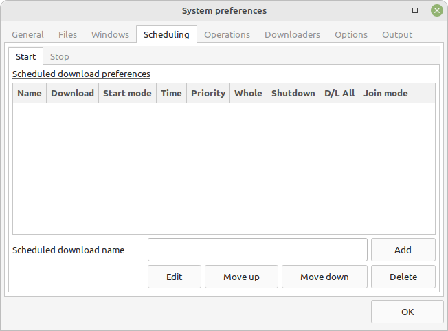

- Click **Edit > System preferences... > Scheduling > Start**
- In the box, type a name for the scheduled download, for example **test**
- Click the **Add** button to create the scheduled download

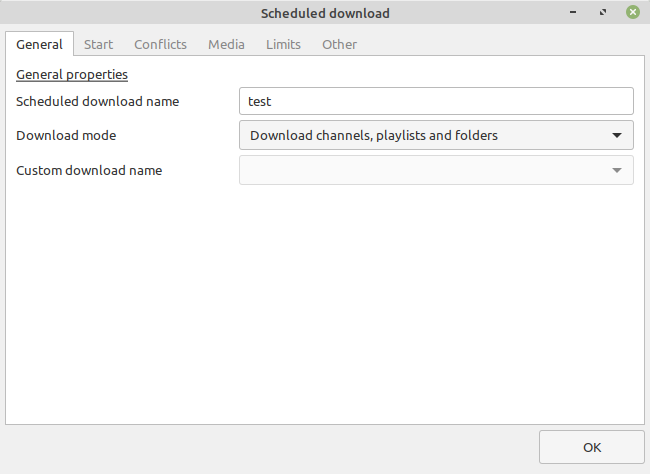

A new window appears. You can use this window to congifure the scheduled download.

- In the **Download mode** box, select whether **Tartube** should check videos, download them, or perform a custom download (see `6.13 Custom downloads`_)
- In the **Start mode** box, select whether this download should be performed once, or when **Tartube** starts, or at regular intervals
- If you choose regular intervals, then you can set the length of the interval

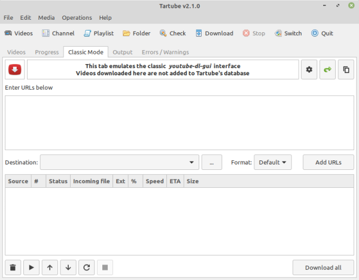

Now click the **Media** tab. By default, a scheduled download checks or downloads everything in **Tartube**'s database, but if you don't want that, you can select individual channels, playlists and folders.

There are several ways to add channels, playlists and folders to this list:

- In the dropdown box, select the channel/playlist/folder, and click **Add**
- In the main window's **Videos** tab, right-click the channel/playlist/folder and select **Downloads > Add to scheduled download...**
- Drag and drop the channel/playlist/folder from the main window into this window

You can create as many scheduled downloads as you like. Scheduled downloads are performed in order, from the top of the list to the bottom.

6.13 Custom downloads
---------------------

By default, **Tartube** downloads videos as quickly as possible, one link (URL) at a time. A link might point to an individual video, or it might point to a whole channel or playlist. **Tartube** will try to download the whole video from its original link.

A **Custom download** enables you to modify this behaviour, if desired. You can use it to fetch videos from a mirror, add random delays, download video clips, or to download videos with the adverts removed.

It's important to note that a custom download behaves exactly like a regular download until you specify the new behaviour.

6.13.1 Creating custom downloads
~~~~~~~~~~~~~~~~~~~~~~~~~~~~~~~~

You can create as many different custom downloads as you like.

- Click **Edit > System preferences... > Operations > Custom**
- In the **Name** box, type any name
- Click the **Add** button
- A new window opens, in which you can specify the new behaviour

If you use custom downloads a lot, you can add some extra buttons to the **Videos** tab.

- Click **Edit > System preferences... > Windows > Main window**
- Click **Show a 'Custom download all' button in the Videos tab** to select it

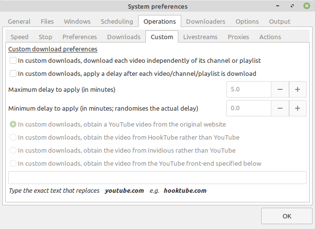

The **Custom download all** button starts the custom download called **general**. The button next to it opens a list of custom downloads. Select one and the custom download will start.

6.13.2 Independent downloads
~~~~~~~~~~~~~~~~~~~~~~~~~~~~

By default, **Tartube** instructs **youtube-dl** to download a channel or a playlist. **youtube-dl** only needs a link to the channel or playlist, so **Tartube** doesn't send it a link to every single video.

If you need to download each individual video directly, for any reason, you can do this:

- Open the window for your preferred custom download. For example, click **Edit > System preferences... > Operations > Custom**, click **general** to select it, and click the **Edit** button
- In the new window, click the **Downloads** tab
- Click **Download each video independently of its channel or playlist** to select it
- Click **Check channels/playlists/folders before each custom download** to select it
- Click **OK** to close the window

Many custom download settings only work when Tartube is downloading videos one at a time. If you enable this setting, you will be able to enable several other settings (including some in the other tabs).

Note that, in earlier verions of **Tartube**, it was necessary to check the channels and playlists yourself, before starting a custom download. If you have selected both buttons, this will no longer be necessary.

6.13.3 Diverting to HookTube / Invidious
~~~~~~~~~~~~~~~~~~~~~~~~~~~~~~~~~~~~~~~~

If **Tartube** can't download a video from YouTube, it's sometimes possible to obtain it from an alternative website instead.

- Open the window for your preferred custom download. For example, click **Edit > System preferences... > Operations > Custom**, click **general** to select it, and click the **Edit** button
- In the new window, click the **Mirrors** tab
- Click **Obtain the video from HookTube rather than YouTube** to select it
- Click **OK** to close the window
- You can now start the custom download

There are a number of alternative YouTube front-ends available, besides `HookTube <https://hooktube.com/>`__. The original `Invidious <https://invidio.us/>`__ closed in September 2020, but there are a number of mirrors, such as `this one <https://invidious.site/>`__. To get a list of mirrors, `see this page <https://instances.invidio.us/>`__, or use your favourite search engine.

When specifying an alternative website, it's very important that you type the *exact text* that replaces **youtube.com** in a video's URL. For example, you must type **hooktube.com**, not **www.hooktube.com** or **http://www.hooktube.com/**.

6.13.4 Delays between downloads
~~~~~~~~~~~~~~~~~~~~~~~~~~~~~~~

If the video website is complaining that you're making too many requests (in other words, downloading too many videos too quickly), it's possible to add a delay betwen downloads. The delay can have a fixed or random duration.

- Open the window for your preferred custom download. For example, click **Edit > System preferences... > Operations > Custom**, click **general** to select it, and click the **Edit** button
- In the new window, click the **Delays** tab
- Click **Apply a delay after each video/channel/playlist is downloaded** to select it
- Set the maximum delay (in minutes)
- If you also set a minimum delay. If you do, **Tartube** uses a random value between the maximum and minimum
- Click **OK** to close the window
- You can now start the custom download

The delay is applied after downloading a channel or a playlist. If you want to apply the delay after each video, you should enable independent downloads as well (as described above).

6.13.5 Splitting and slicing videos
~~~~~~~~~~~~~~~~~~~~~~~~~~~~~~~~~~~

During a custom download, you can automatically split a video into video clips *while it is being downloaded*. A list of clips can be grabbed from the video's description, or from its chapter list, or you can specify your own list of clips. For more information, see see `6.26 Video clips`_

You can also remove slices from a video *while it is being downloaded*. This is useful for removing adverts, intro and outros. A list of video slices is obtained from a `SponsorBlock server <https://sponsor.ajay.app/>`__. Alternatively, you can specify your own list of video slices. For more information, see see `6.27 Video slices`_

Both of these features require **FFmpeg**.

6.13.6 Launching custom downloads
~~~~~~~~~~~~~~~~~~~~~~~~~~~~~~~~~

Besides the optional button described above, there are several ways to start a custom download.

- Right-click a video, and select **Custom download video**
- Right-click a channel, playlist or folder, and select **Custom download channel**, and so on
- In the Classic Mode tab, click the menu icon in the top-right corner, and select **Enable custom downloads**. Then click the **Custom download all** button in the bottom-right corner
- From the main menu, click **Operations > Custom download all**

6.14 Watching videos
--------------------

If you've downloaded a video, you can watch it by clicking the word **Player**.

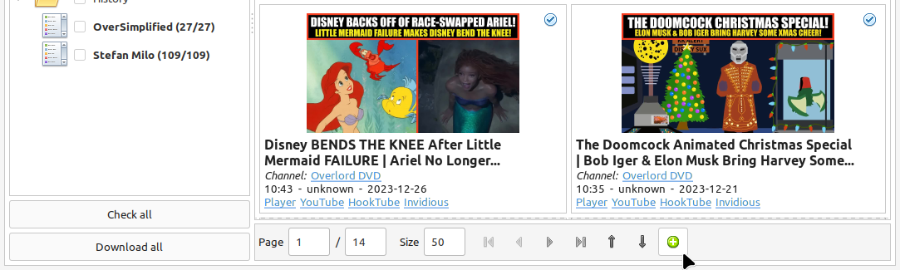

If you haven't downloaded the video yet, you can watch it online by clicking the word **Website** or **YouTube**. (One or the other will be visible).

Restricted YouTube videos (not available in your region, or not visible without a Google account) can often be watched without restrictions on an alternative website, such as `HookTube <https://hooktube.com/>`__ or an Invidious mirror `such as this one <https://invidious.site/>`__.

As mentioned above, the original Invidious has now closed. You can change the Invidious mirror that **Tartube** is using, if you like.

- Click **Edit > System preferences... > Operations > Preferences**
- Enter a new Invidious mirror in the box
- Click **OK** to close the window
- You can now watch a video by clicking its **Invidious** label

6.15 Filtering and finding videos
---------------------------------

Beneath the videos you'll find a toolbar. The buttons are self-explanatory, except for the one on the right.

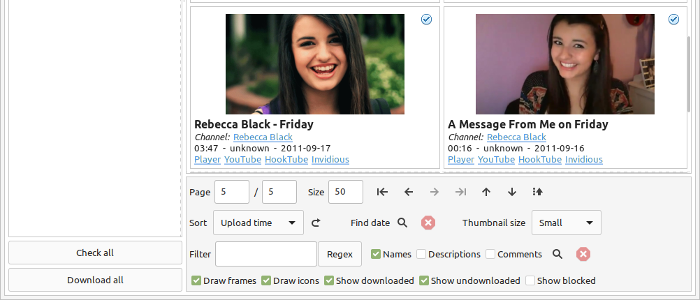

Click that button, and a larger toolbar is revealed. You can use this to filter out videos, change the order in which videos are displayed, or find a video uploaded at a certain date.

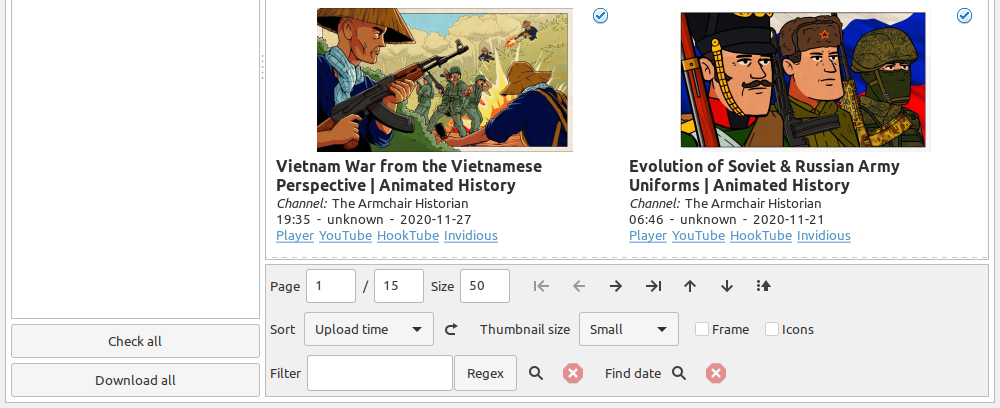

- Use the **Sort** box to change how videos are sorted. The button next to it can be used at any time force a re-sort
- Use the **Thumbnail size** box to change the size of the video grid (it doesn't affect other layouts)
- Toggle the **Frame** and **Icons** buttons to tweak the layout

You can search for videos by applying a filter. For example, you could search for videos whose name contains the word **History**:

- In the **Filter** box, type **History**
- The search is case-insensitive, so it doesn't matter if you type **History** or **history**
- Click the magnifiying glass button. All matching videos are displayed
- Click the cancel button next it to remove the filter

You can also search using a *regular expression* (regex), too. These searches are also case-insensitive. For example, to find all videos whose name begins with the word "Minecraft":

- In the **Filter** box, type **\^Minecraft**
- Click the **Regex** button to select it
- Click the magnifying glass button. All matching videos are displayed
- To search using ordinary text, rather than a regex, de-select the **Regex** button

Alternatively, you can find videos uploaded around a certain date.

- Click the **Find date** button to select a date
- If there are several pages of videos, **Tartube** will show the page containing the videos uploaded closest to this date

6.16 Marking videos
-------------------

You can mark videos, channels, playlists and folders that you find interesting, or which are important.

- You can **bookmark** a video
- You can **favourite** a channel, playlist or folder

Bookmarked and favourite videos shouldn't be confused with archived videos, which are protected from automatic deletion - see `6.18 Archiving videos`_.

6.16.1 Bookmarked videos
~~~~~~~~~~~~~~~~~~~~~~~~

There are several ways to bookmark a video.

- Right-click a video, and click **Mark Video > Video is bookmarked** to select it
- If the **B/mark** label is visible under the video's name, click it. (If not, click the **Switch** button to select a different layout)
- Right-click a channel, and select **Channel contents > Mark as bookmarked**. This will bookmark every video in the channel, but it won't automatically bookmark videos that are added to the channel later
- (This can also be done with playlists and folders)

A bookmarked video appears in **Tartube**'s own **Bookmarks** folder, as well as in its usual location.

6.16.2 Favourite channels, playlists and folders
~~~~~~~~~~~~~~~~~~~~~~~~~~~~~~~~~~~~~~~~~~~~~~~~

When you mark a channel, playlist or folder as a favourite, all of its videos will also be visible in **Tartube**'s own **Favourite Videos** folder.

If new videos are later added to the channel, playlist or folder, they will automatically appear in the **Favourite Videos** folder.

(It's possible to mark or unmark an individual video as a favourite, but it's better to use bookmarking for that.)

- Right-click a channel, and select **Channel contents > Mark as favourite**
- Right-click a playlist, and select **Playlist contents > Mark as favourite**
- Right-click a folder, and select **Folder contents > All contents > Mark as favourite**
- If you just want to mark the videos in a folder as favourites, but not any channels or playlists it contains, select **Folder contents > Just folder videos > Mark as favourite**

6.17 Combining channels, playlists and folders
----------------------------------------------

**Tartube** can download videos from several channels and/or playlists into a single directory (folder) on your computer's filesystem. There are four situations in which this might be useful:

- A channel has several playlists. You have added both the channel and its playlists to **Tartube**'s database, but you don't want to download duplicate videos
- A creator releases their videos on **Odysee** as well as on **YouTube**. You have added both channels, but you don't want to download duplicate videos
- You don't care about keeping videos in separate directories/folders on your filesystem. You just want to download all videos to one location
- A separate application will process the videos, after Tartube has downloaded them

6.17.1 Combining one channel and many playlists
~~~~~~~~~~~~~~~~~~~~~~~~~~~~~~~~~~~~~~~~~~~~~~~

A creator might have a single channel, and several playlists. The playlists contain videos from that channel (but not necessarily *every* video).

You can add the channel and its playlists in the normal way but, if you do, **Tartube** will download many videos twice.

The solution is to tell **Tartube** to store all the videos from the channel and its playlists in a single location. In that way, you can still see a list of videos in each playlist, but duplicate videos are not actually downloaded.

- Click **Media > Add channel**..., and then enter the channel's details
- Click **Media > Add playlist**... for each playlist
- Now, right-click on each playlist in turn, and then select **Playlist actions > Set download destination...**
- In the dialogue window, click **Use a different location**, select the name of the channel, then click the **OK** button.

6.17.2 Combining channels from different websites
~~~~~~~~~~~~~~~~~~~~~~~~~~~~~~~~~~~~~~~~~~~~~~~~~

A creator might release their videos on **YouTube**, but also on a site like **Odysee**. Sometimes they will only release a particular video on **Odysee**.

You can add both channels in the normal way but, if you do, **Tartube** will download many videos twice.

The solution is to tell **Tartube** to store videos from both channels in a single location. In that way, you can still see a list of videos in each channel, but duplicate videos are not actually downloaded.

- Click **Media > Add channel**..., and then enter the **YouTube** channel's details
- Click **Media > Add channel**..., and then enter the **Odysee** channel's details
- Right-click the **Odysee** channel and select **Channel actions > Set download destination...**
- In the dialogue window, click **Use a different location**, select the name of the **YouTube** channel, then click the **OK** button

It doesn't matter which of the two channels you use as the download destination. There is also no limit to the number of parallel channels, so if a creator uploads videos to a dozen different websites, you can add them all.

6.17.3 Download all videos to a single folder
~~~~~~~~~~~~~~~~~~~~~~~~~~~~~~~~~~~~~~~~~~~~~

If you don't care about keeping videos in separate directories/folders on your filesystem, you can download *all* videos into the **Unsorted videos** folder. Regardless of whether you have added one channel or a thousand, all the videos will be stored in that one location.

- Click **Edit > General download options... > Files > Filesystem**
- Click the **Download all videos into this folder** button to select it
- In the combo next to it, select **Unsorted Videos**

Alternatively, you could select **Temporary Videos**. If you do, videos will be deleted when you restart **Tartube** (and will not be re-downloaded in the future).

6.17.4 Download all videos to an external folder
~~~~~~~~~~~~~~~~~~~~~~~~~~~~~~~~~~~~~~~~~~~~~~~~

By default, all files are downloaded into Tartube's data folder. Users often request that **Tartube** should be able to download videos to other locations in the filesystem, *while retaining those videos in Tartube's database.*

A whole bunch of things can go wrong when we start writing files to arbitrary locations on hard drives that may or may not be accessible in the future. Tartube is simply not designed to handle file input/output of that complexity.

In addition, writing files outside Tartube's data folder breaks portability because it's no longer possible for the folder to copied or moved anywhere else.

Nevertheless, since v2.4.0 it has been possible to download videos to any location in the filesystem for which you have read/write permissions. (It has always been possible to do so from the **Classic Mode** tab). *Don't do it without a good reason*. Good reasons include:

- A separate application will process the videos, after Tartube has downloaded them
- You want some videos (but not others) to be available on a drive shared between several devices
- You are an advanced user and you're happy to deal with any filesystem problems yourself

If one of these reasons applies, then you can do this:

- Right-click a channel, playlist or folder, and select **Channel actions > Set download destination...** (etc)
- Select **Use an external location**
- Click the **Set** button, and choose an external folder
- When you're ready, click the **OK** button to apply your changes

6.17.5 External folders and yt-dlp
~~~~~~~~~~~~~~~~~~~~~~~~~~~~~~~~~~

Users of `yt-dlp <https://github.com/yt-dlp/yt-dlp/>`__ should be aware of the download option **--paths**, which may be more convenient in some situations. See the **yt-dlp** documentation for more information about how it works. In Tartube, it can be configured like this:

- Click **Edit > General download options...**
- If the **Show advanced download options** button is visible, clicke it
- Now click the **yt-dlp** tab
- The option **--output** can be set in the **Output** tab
- The option **--paths** can be set in the **Paths** tab

6.18 Archiving videos
---------------------

You can tell **Tartube** to automatically delete videos after some period of time. This is useful if you don't have an infinitely large hard drive.

- Click **Edit > System preferences... > Files > Videos**
- Click the **Automatically delete downloaded videos after this many days** button to select it
- If you want to, change the number of days from **30** to some other value

If you want to protect your favourite videos from being deleted automatically, you can *archive* them. Only videos that have actually been downloaded can be archived.

- Right-click a video, and select **Video is archived**

You can also archive all the videos in a channel, playlist or folder.

- For example, right-click a folder and select **Channel contents > Mark videos as archived**
- This action applies to *all* videos that are *currently* in the folder, including the contents of any channels and playlists in that folder
- It doesn't apply to any videos you might download in the future

6.19 Performance limits
-----------------------

By default, **Tartube** downloads two video, channels or playlists at a time, as quickly as possible (in other words, without bandwidth limits).

You can change this behaviour in the **Progress** tab, if you want.

- At the bottom of the tab, select the **Max downloads** button, and change the maximum number of simultaneous downloads
- Alternatively, select the **D/L speed** button, and set the maximum bandwidth you're willing to allocate to **Tartube**

These are the default settings. Many users might want lower download speeds during the day, but higher download speeds at night (and so on).

- Click **Edit > System preferences... > Operations > Limits**
- The settings in the top half of the tab are the ones visible in the **Progress** tab
- The settings in the bottom half of the tab apply only during certain times of the day, and on certain days

There is a third way to change **Tartube**'s behaviour. The maximum downloads and bandwidth limits can also be set for a scheduled download (see `6.12 Scheduled downloads`_).

**Tartube** honours most requests to change the maximum downloads and the bandwidth limit, so it's not a good idea to set lots of different values.

6.20 Managing databases
-----------------------

**Tartube** downloads all of its videos into a single directory (folder) - the **Tartube data directory**. The contents of this directory comprise the **Tartube database**.

**Tartube** stores important files here, some of which are invisible (by default). Don't let other applications store their files here, too.

*You can modify the contents of the directory yourself, if you want, but don't do that while Tartube is running.*

It's fine to add new videos to the database, or to remove them. Just be careful that you don't delete any sub-directories (folders), including those which are hidden, and don't modify the **Tartube** database file, **tartube.db**.

6.20.1 Importing videos from other applications
~~~~~~~~~~~~~~~~~~~~~~~~~~~~~~~~~~~~~~~~~~~~~~~

**Tartube** is a GUI front-end for **youtube-dl**, but it is not the only one. If you've downloaded videos using another application, this is how to add them to **Tartube**'s database.

- In **Tartube**'s main window, add each channel and playlist in the normal way
- When you're ready, click the **Check all** button. This adds a list of videos to **Tartube**'s database, without actually downloading the videos themselves
- Copy the video files into **Tartube**'s data directory (folder). For example, copy all your **PewDiePie** videos into **../tartube-data/downloads/PewDiePie**
- In the **Tartube** menu, click **Operations > Refresh database...**. **Tartube** will search for video files, and try to match them with the list of videos you just compiled
- The whole process might some time, so be patient

6.20.2 Multiple databases
~~~~~~~~~~~~~~~~~~~~~~~~~

**Tartube** can only use one database at a time, but you can create as many as you want.

For example, you could create a new database on an external hard drive.

- In the main window's menu, click **File > Database preferences...**
- In the new window, click the **Change** button
- Another new window appears. Use it to create a directory (folder) on your external hard drive

**Tartube** remembers the location of the databases it has loaded. To switch back to your original database:

- In the main menu, click **File > Database preferences...**
- In the list, click the original database to select it
- Click the **Switch** button

6.20.3 Multiple Tartubes
~~~~~~~~~~~~~~~~~~~~~~~~

**Tartube** can't load more than one database, but you can run as many instances of **Tartube** as you want.

If you have added three databases to the list, and if you have three **Tartube** windows open at the same time, then by default each window will be using a different database.

By default, the databases are loaded in the order they appear in the list.

6.20.4 Exporting/importing the database
~~~~~~~~~~~~~~~~~~~~~~~~~~~~~~~~~~~~~~~

You can export the contents of **Tartube**'s database and, at any time in the future, import that information into a different **Tartube** database, perhaps on a different computer.

It is important to note that *only a list of videos, channels, playlists and folders are exported*. The videos themselves are not exported, and neither are any thumbnail, description or metadata files.

- Click **Media > Export from database...**
- In the dialogue window, choose what you want to export
- If you want a list that you can edit in an ordinary text editor, select the **Export as plain text** option
- If you want a list that yuu can edit in a spreadsheet, select the **Export as CSV** option
- Click the **OK** button, then select where to save the export file

It is safe to share this export file with other people. It doesn't contain any personal information.

This is how to import the data into a different **Tartube** database.

- Click **Media > Import into database...**
- Select the export file you created earlier
- A dialogue window will appear. You can choose how much of the database you want to import

6.21 Converting to audio
------------------------

**Tartube** can automatically extract the audio from its downloaded videos, if that's what you want.

The first step is to make sure that either FFmpeg or AVconv is installed on your system - see `6.4 Installing FFmpeg / AVConv`_.

The remaining steps are simple:

- In **Tartube**'s main window, click **Edit > General download options...**

In the new window, do this:

- Click the **Sound Only** tab
- Select the checkbox **Download each video, extract the sound, and then discard the original videos**
- In the boxes below, select an audio format and an audio quality
- Click the **OK** button at the bottom of the window to apply your changes

Alternatively, if you have enabled advanced options (see `6.11.1 Advanced download options`_) then the **Post-processing** tab will be visible, and you can do this:

- Click on the **Post-processing** tab
- Select the checkbox **Post-process video files to convert them to audio-only files**
- In the box labelled **Audio format of the post-processed file**, specify what type of audio file you want - **.mp3**, **.wav**, etc
- If you want, click the button **Keep video file after post-processing it** to select it
- Click the **OK** button at the bottom of the window to apply your changes

Some websites, such as **YouTube**, allow you to download the audio (in **.m4a** format) directly, without downloading the whole video, and without using **FFmpeg** or **AVconv**.

- In **Tartube**'s main window, click **Edit > General download options... > Formats**
- In the list on the left-hand side, select an **.m4a** format
- Click the **Add format >>>** button to add it to the list on the right
- Click the **OK** button at the bottom of the window to apply your changes

6.22 Classic Mode
-----------------

**Tartube** compiles a database of the videos, channels and playlists it has downloaded.

If you want something simpler, then click the **Classic Mode** tab, which has an interface that looks just like `youtube-dl-gui <https://mrs0m30n3.github.io/youtube-dl-gui/>`__.

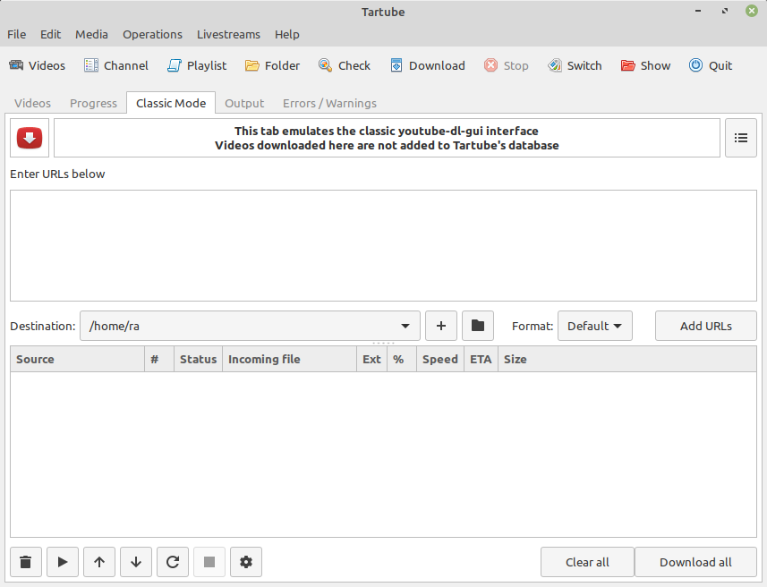

- Copy and paste the links (URLs) of videos, channels and/or playlists into the box at the top
- Click the **+** button to select a destination. All the videos are downloaded to this location
- Select a video or audio format, or leave the **Default** setting enabled
- The video might not exist in your preferred format, but if FFmpeg or AVConv is installed on your system, the video can be converted
- Next, click the **Add URLs** button
- If you like, you can add more videos/channels/playlists, using a different destination and/or a different format
- When you're ready, click the **Download all** button

**Tartube** doesn't add any of these videos to its database. When you restart **Tartube**, all of the URLs will be gone. However, the videos themselves will still be on your hard drive.

Because the videos aren't in a database, you can move them anywhere you want (once you've finished downloading them).

6.22.1 Customising Classic Mode
~~~~~~~~~~~~~~~~~~~~~~~~~~~~~~~

If you *only* use this tab, you can tell **Tartube** to open it automatically.

- Click **Edit > System preferences... > Windows > Main window**
- Select **When Tartube starts, automatically open the Classic Mode tab**

If you don't want **Tartube** to forget URLs when it restarts, you can do this:

- Click the menu button in the top-right corner of the tab
- Click **Remember URLs** to select it
- **Tartube** will only remember URLs that haven't been downloaded yet

A separate set of download options (see `6.11 Download options`_) usually applies to the Classic Mode tab. You can change this behaviour, if you like.

- Click the menu button in the top-right corner of the tab
- Click **Set download options** to see the complete list of download options
- Alternatively, click **Use default download options** to use the download options called **general**

In the same menu, custom downloads can be enabled (see `6.13 Custom downloads`_). Depending on the behaviour you've selected, **Tartube** may fetch a list of videos from each URL, before downloading them (so don't be alarmed if each URL is 'downloaded' twice).

In the bottom half of the window, you can select one or more URLs by clicking them. The buttons in the bottom-left apply to the selected URLs. Let your mouse hover over a button, to see what it does.

6.23 Livestreams
----------------

**Tartube** can detect livestreams, and to notify you when they start.

At the moment, this feature only works on **YouTube**, and it doesn't work at all on 32-bit MS Windows.

6.23.1 Detecting livestreams
~~~~~~~~~~~~~~~~~~~~~~~~~~~~

**Tartube** searches for livestreams whenever you check or download channels and playlists.

Livestreams are easy to spot. A livestream that hasn't started yet has a red background. A video that's streaming now has a green background. (Livestreams that have finished have a normal background.)

**YouTube** sometimes 'streams' a pre-recorded video at an appointed time, as if were a livestream. These 'debut' or 'premiere' videos are shown in slightly different colours - orange before the stream starts, and cyan while it is in progress.

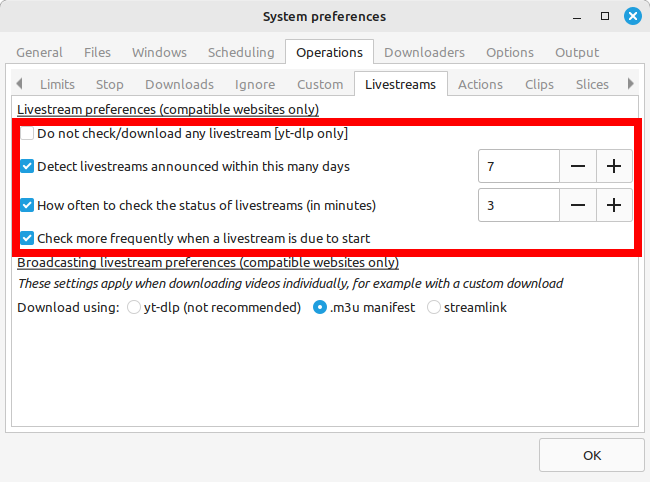

Every few minutes, **Tartube** checks whether a livestream (or debut) has started or stopped. This happens automatically in the background; there is no need for you to do anything.

6.23.2 Customising livestreams
~~~~~~~~~~~~~~~~~~~~~~~~~~~~~~

You can modify how often livestreams are checked (and whether they are checked at all). Click **Livestreams > Livestream preferences...**.

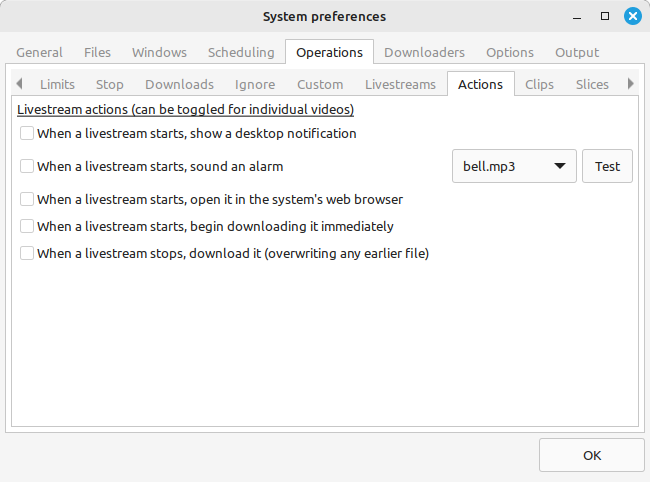

For technical reasons, there are practical limits to what **Tartube** can detect. On busy channels, **Tartube** may not be able to detect livestreams that were announced some time ago. Even if you change the number of days from 7 to a very large number, there is no guarantee that **Tartube** will detect everything. (If you change the value to 0, **Tartube** will only detect livestreams that are listed before any ordinary videos.)

By default, **Tartube** checks a livestream every three minutes, waiting for it to start (or stop). When a livestream is due to start, a check happens every minute. Making more frequent checks is probably not a good idea - the website might block you.

If you want to force a check, in the main window click **Livestreams > Update existing livestreams**. (Checks are silent, so don't worry if nothing seems to be happening).

6.23.3 Livestream notifications
~~~~~~~~~~~~~~~~~~~~~~~~~~~~~~~

It's really useful to be notified when a livestream is starting. In the same window, click the **Actions** tab.

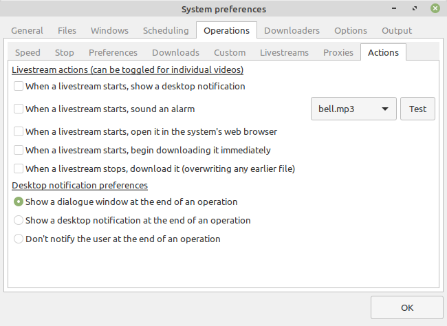

**Desktop notifications** do not work on MS Windows yet.

**Tartube** provides a number of sound effects. You can choose the one you want to use as an alarm. If you want to add your own sound effects, find the directory (folder) where Tartube is installed, copy the new **.mp3** or **.wav** files into **../sounds**, and then restart **Tartube.**

Most users will prefer to leave all of these checkboxes unselected, and instead set up notifications only for the livestreams they want to see.

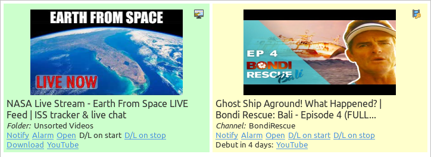

- Click **Notify** to show a desktop notification when the stream starts (does not work on MS Windows)
- Click **Alarm** to sound an alarm when the stream starts
- Click **Open** to open the stream in your web browser as soon as it starts
- If you think the stream might be removed from the website, you can click **D/L on start** or **D/L on stop**. If you click both of them, **Tartube** will download the video twice. (Think of the second one as a backup, in case the first download doesn't succeed.)

To disable any of these actions, simply click the same label again.

**NOTE:** At the time of writing (December 2020), **youtube-dl** often fails to download **YouTube** livestreams while they are broadcasting. For an alternative download method, see `6.23.5 Youtube Stream Capture`_. **youtube-dl** will often download livestreams from other websites successfully.

6.23.4 Compatible websites
~~~~~~~~~~~~~~~~~~~~~~~~~~

**Tartube**'s livestream detection has only been tested on **YouTube**. It's possible that it might work on other websites, if they behave in the same way. Here is how to set it up.

Firstly, find the RSS feed for the channel or playlist. You may have to use a search engine to find out how to do that. (For **YouTube** channels/playlists, **Tartube** finds the feed for you automatically.)

Secondly, right-click the channel and select **Show > Channel properties...** (alternatively, right-click a playlist and select **Show > Playlist properties...**)

Now click the **RSS feed** tab. Enter the link (URL) to the RSS feed in the box. Click the **OK** button to close the window.

6.23.5 Youtube Stream Capture
~~~~~~~~~~~~~~~~~~~~~~~~~~~~~

**Tartube** v2.3.0 adds support for `Youtube Stream Capture <https://github.com/mrwnwttk/youtube_stream_capture>`__ (YTSC), a script that can download livestreams from **YouTube** independently of **youtube-dl**.

Support for YTSC is EXPERIMENTAL. It does not work at all on MS Windows (under MSYS2), or on any website besides **YouTube**. It does not work at all for livestreams that broadcast continuously, 24/7. It is not guaranteed to work with every livestream.
Before using YTSC, you must install both `FFmpeg <https://ffmpeg.org/>`__ and `aria2 <https://aria2.github.io/>`__ on your system.

**Tartube** includes a copy of YTSC. If YTSC has been updated, you use the updated version instead.  After `downloading it <https://github.com/mrwnwttk/youtube_stream_capture>`__, click **Edit > System preferences... > Downloaders > Stream Capture**, click the **Set** button, and select the path to the file **youtube_stream_capture.py**. Note that the original version of YTSC requires the `Python Colorama module <https://pypi.org/project/colorama/>`__, which you must install on your system.

YTSC is disabled by default. To enable it, click **Edit > System preferences... > Operations > Live**, and select the box **Use Youtube Stream Capture to download broadcasting livestreams**.

**Tartube** can make multiple attempts to download the livestream, if the first attempt fails. This behaviour can be modified in the preference window, if necessary. Even during a successful attempt, a download might not start immediately.  Reducing the restart time lower than a minute is not recommended.

Likewise, the download might continue after the livestream has stopped broadcasting. This is normal; please be patient with very long livestreams.

YTSC downloads a livestream in segments. At the end of the download, the segments must be merged into a single video. Again, this might take several minutes.

6.24 Detecting missing videos
-----------------------------

**Tartube** can detect videos you have downloaded, but which have been since deleted by the original uploader.

* Click **Edit > System preferences... > Operations > Preferences**
* Click the button **Add videos which have been removed from a channel/playlist to the Missing Videos folder** to select it

Having enabled detection, removed videos will appear in the **Missing Videos** folder. To empty that folder, right-click it and select **Folder contents > All contents > Mark as not missing**.

**Tartube** only detects missing videos when checking/downloading whole channels or playlists. If you interrupt a download, no detection occurs.

6.25 More information about FFmpeg and AVConv
---------------------------------------------

6.25.1 Using FFmpeg / AVConv with youtube-dl
~~~~~~~~~~~~~~~~~~~~~~~~~~~~~~~~~~~~~~~~~~~~

If you explicitly set the location of the **FFmpeg** and/or **AVConv** executables, then those locations are passed on to **youtube-dl** when you check or download videos.

If *both* locations are set, only one of them is passed on. Usually, that's the location of **FFmpeg**. However, if you specify the **prefer_avconv** download option, then **AVConv** is passed on, instead.

- Click **Edit > General download options...**
- In the new window, if the **Show advanced download options** button is visible, click it
- Now click the **Post-processing** tab
- Click the **Prefer AVConv over FFmpeg** button to select it
- Make sure the **Prefer FFmpeg over AVConv (default)** button is not selected
- Click **OK** to apply your changes

For more information about download options, see `6.11 Download options`_.

6.25.2 Using FFmpeg directly
~~~~~~~~~~~~~~~~~~~~~~~~~~~~

You can process videos and thumbnails with **FFmpeg** directly, if you need to. This is useful for converting a file from one format to another, and for many other tasks.

- Click a video, or select several videos together
- Right-click them and select **Special > Process with FFmpeg...**
- The FFmpeg options window opens

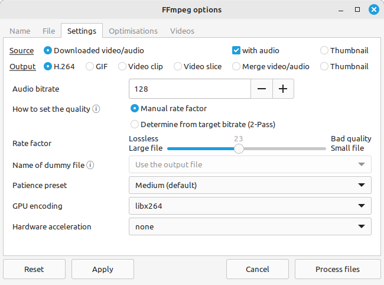

FFmpeg options behave much like download options.

- You can click the **Show more FFmpeg options** to show advanced options
- One set of FFmpeg options is the *current* one
- If you want to switch to a different set, click **Edit > System preferences... > Options > FFmpeg options**
- FFmpeg options are saved with the **Tartube** database; you can **Export** and **Import** them between databases

The box at the top allows you to add FFmpeg options directly. For example, to convert the framerate of some videos to 24 fps, add the following text:

        **-r 24**

6.25.3 Using FFmpeg options
~~~~~~~~~~~~~~~~~~~~~~~~~~~

In the options windows, click the **File** tab.

Converting a video from one format to another is as simple as adding the text **avi** or **mkv** (or any other valid video format) to the box **Change file extension**,

The **Videos** tab contains an optional list of videos. These are the videos that are processed, when you click the **Process files** button in the bottom-right corner. (If the list is empty, you will see an **OK** button instead).

You can add videos to this list by dragging and dropping them. Dragging from an external application is allowed, if the videos are also visible somewhere in **Tartube**'s main window (for example, in its database, or in the **Classic Mode** tab).

6.25.4 Advanced FFmpeg options
~~~~~~~~~~~~~~~~~~~~~~~~~~~~~~

Now click the **Name** tab again. One box shows the **FFmpeg** system command that will be used to process the videos.

Now, if you click the **Show more FFmpeg options** button, you'll notice that the system command changes radically, and that two new tabs have appeared. Go ahead and click the new **Settings** tab.

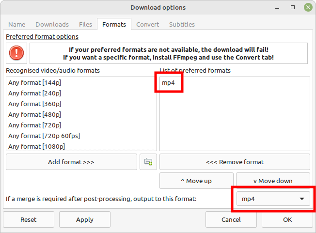

This tab defines a *source file* and an *output* file.

The *source file* can be a video, or a thumbnail. If you select **Video thumbnail**, then FFmpeg will process the thumbnails associated with videos listed in the **Videos** tab; otherwise, it will process the video files themselves.

The *output file* setting defines whatever you're trying to achieve. If you want **FFmpeg** to produce a video, then **H.264** is the most useful setting (but you could also choose **GIF**).

When youtube-dl downloads a video, it often downloads the video and audio components seperately. The two pieces are then merged by FFmpeg. Usually, all of this happens automatically, but if the merge didn't succeed (or wasn't attempted), you can try again by selecting **Merge video/audio**. This settings expects to find a video file and an audio file with the same name (but with different file extensions).

If the *source file* is a thumbnail, then the *output file* must also be a thumbnail.

6.26 Video clips
----------------

**Tartube** can download parts of a video. It can also split up a video it has already downloaded. This functionality requires **FFmpeg**.

**Tartube** can extract a list of timestamps from a video's description. It can also extract the chapter list from a video's metadata (**.info.json**) file. If you want to specify timestamps manually, or want to create a video clips one at a time, you can do that too.

It's important to be aware of the limitations of this feature.

- Downloading video clips will take longer, perhaps much longer, than downloading the full video
- Some video formats cannot be divided into clips accurately. **.mp4** is much better than **.webm**. If you want to download video clips, we recommend downloading in **.mp4** format
- If you want clips that start and end at a particular frame, **Tartube** is not a suitable tool. Use a dedicated video editor instead

6.26.1 Video clip preferences
~~~~~~~~~~~~~~~~~~~~~~~~~~~~~

Before you start, take a look at the video clip preferences (click **Edit > System preferences... > Operations > Clips**).

- It will save a lot of time if you let **Tartube** automatically extract timestamps, so most users should enable that
- Video clips are stored in the **Video Clips** folder by default, but you can store them alongside the original video, if you prefer
- Video clips can be added to **Tartube**'s database, either alongside or instead of the original video
- If you're going to make a lot of video clips, you can store them in a sub-folder (one for each original video)

If your database already contains a lot of videos, you can ask **Tartube** to extract timestamps from their descriptions.

- Click **Edit > System preferences > Files > Videos**
- Click the button **Extract timestamps for all videos**

If you prefer to update videos one at a time, right-click the video and select **Show video > Properties... > Timestamps**. Then click the button **Reset list using video description**.

6.26.2 Quick video clips
~~~~~~~~~~~~~~~~~~~~~~~~

This is the quickest way to create a video clip:

- After checking a video, you can right-click it and then select **Special > Download video clip...**
- After downloading a video, you can right-click it and then select **Special > Create video clip...**

In the new dialogue window, you must specify the start of the clip. If you don't specify the end of the clip, then the end of the video is used.

Timestamps must include both minutes and seconds. Hours are optional. Leading zeroes are also optional. All of the following timestamps are valid:

        **15:29**

        **1:15:29**

        **01:15:29**

        **0:29**

Click the **Download this clip** button to get started. Alternatively, if **Tartube** has already extracted a list of timestamps for this video, you can click the **Download all clips** button instead.

6.26.3 Downloading video clips
~~~~~~~~~~~~~~~~~~~~~~~~~~~~~~

If you frequently create video clips, then you should set up custom downloads (see `6.13 Custom downloads`_).

- Open the window for your preferred custom download. For example, click **Edit > System preferences... > Operations > Custom**, click **general** to select it, and click the **Edit** button
- In the new window, click the **Downloads** tab
- Click **Download each video independently of its channel or playlist** to select it
- After that, you will be able to select **Split videos into video clips using timestamps (requires FFmpeg)**
- Click **OK** to close the window

The next step is to check any videos, channels and playlists (for example by clicking the big **Check all** button in the **Videos** tab).

This will fetch information about the videos. In many cases, a video's description will include a list of timestamps, and in other cases the video's metadata will include a list of chapters. Assuming that you enabled the auto-extract settings (as described above), that information will have been extracted. If not, you can enter some timestamps manually: right-click a video, and select **Show video > Properties > Timestamps**.

Each video clip is represented by two timestamps: a start and a stop timestamp. The start timestamp is compulsory. The stop timestamp is optional; if it isn't specified, then the video clip will end at the beginning of the *next* video clip (or at the end of the video, if there are no more.)

When you're ready, perform a custom download in the normal way (for example, by clicking **Operations > Custom download all**). Videos will be downloaded as a series of video clips. (If no timestamps have been specified, then the video is downloaded whole.)

6.26.4 Extracting video clips
~~~~~~~~~~~~~~~~~~~~~~~~~~~~~

If you have already downloaded a video, then you can split it into video clips.

- Right click the video, and select **Special > Process with FFmpeg...**
- If the **Clips** tab is visible, click it
- Otherwise, the **Settings** tab will be visible. Click it, then in the **Output** line, select **Video clip**

You can split a video using the timestamps already extracted, or you can select **Split videos using these timestamps** to specify your own timestamps. The second option is useful if FFmpeg is acting on multiple videos at the same time.

When you're ready to go, click the **Process files** button.

6.26.5 Video clip shortcuts
~~~~~~~~~~~~~~~~~~~~~~~~~~~

Video clips can be downloaded from the **Classic Mode** tab. Before downloading, click the menu button in the top-right corner of the tab, and select **Enable custom downloads**. Don't forget that clips can be downloaded in other formats, such as **.mp3**.

Users of `yt-dlp <https://github.com/yt-dlp/yt-dlp/>`__ should be aware that the download option **--split-chapters** exists, which may be more convenient in some situations.

6.27 Video slices
-----------------

Unwanted parts of a video, such as adverts and intro/outro music, are called **video slices**.

**Tartube** can download a video with the slices removed. It can also remove slices from a video you have already downloaded. This functionality requires **FFmpeg**.

**Tartube** contacts a `SponsorBlock <https://sponsor.ajay.app/>`__ server to get a list of video slices. Not all videos have been added to the SponsorBlock database, so you can also specify your own slices when necessary.

It's important to be aware of the limitations of this feature.

- Downloading and slicing a video will take longer, perhaps much longer, than a normal download. For most users it will be quicker just to skip over (or watch!) the adverts
- Some video formats cannot be sliced accurately. **.mp4** is much better than **.webm**. If you want to remove slices, we recommend downloading videos in **.mp4** format
- If you want to remove slices starting and ending at a particular frame, **Tartube** is not a suitable tool. Use a dedicated video editor instead

6.27.1 Video slice preferences
~~~~~~~~~~~~~~~~~~~~~~~~~~~~~~

Before you start, take a look at the video slice preferences (click **Edit > System preferences... > Operations > Slices**).

- It will save a lot of time if you let **Tartube** contact **SponsorBlock** automatically, every time a video is checked or downloaded
- Obfuscating the video's ID is recommended to protect your privacy. **SponsorBlock** will not know for sure which video you're looking for, so it will send data for a range of videos; **Tartube** will ignore the other videos

If you want to update a video, you can right-click it and select **Check video**, which will update the video and contact **SponsorBlock** for a second time.

6.27.2 Quick video slices
~~~~~~~~~~~~~~~~~~~~~~~~~

This is the quickest way to removes a slice from a video:

- After checking or downloading a video, you can right-click it and then select **Special > Remove video slices...**
- Enter a start time
- The stop time is optional. If you don't specify it, the end of the video is used

Start/stop times should be in seconds. Fractional values are allowed:

        **20**

        **55.5**

You can specify timestamps instead of seconds. Timestamps must include both minutes and seconds. Hours are optional. Leading zeroes are also optional. All of the following timestamps are valid:

        **15:29**

        **1:15:29**

        **01:15:29**

        **0:29**

Click the **Download this sliced video** button to get started. Alternatively, if **Tartube** has already obtained slice data from **SponsorBlock**, you can click the **Download video with all slices removed** button instead.

6.27.3 Downloading sliced videos
~~~~~~~~~~~~~~~~~~~~~~~~~~~~~~~~

If you frequently remove slices from videos, then you should set up custom downloads (see `6.13 Custom downloads`_).

- Open the window for your preferred custom download. For example, click **Edit > System preferences... > Operations > Custom**, click **general** to select it, and click the **Edit** button
- In the new window, click the **Downloads** tab
- Click **Download each video independently of its channel or playlist** to select it
- After that, you will be able to select **Remove slices from the video using SponsorBlock data (requires FFmpeg)**
- Select which types of slice you want to remove. To remove self-promotions, select **selfpromo** in the drop-down box, and click the **Toggle** button
- Click **OK** to close the window

The next step is to check any videos, channels and playlists (for example by clicking the big **Check all** button in the **Videos** tab).

This will fetch information about the videos. Assuming that you allowed Tartube to contact SponsorBlock automatically (as described above), some of those videos will now have a red icon next to them, indicating that a list of slices has been obtained. If not, you can enter some slices manually: right-click a video, and select **Show video > Properties > Slices**.

Each video slice is represented by four properties:

- The start and stop times, in seconds or as timestamps
- The stop time is optional. If you don't specify it, the end of the video is used
- **Category** is the type of slice; for example, a **sponsor** slice is an advert
- At the moment, there is only one **Action Type** available: **skip** means to remove the slice from the video

When you're ready, perform a custom download in the normal way (for example, by clicking **Operations > Custom download all**). Tartube will download the video as a sequence of video clips, before concatenating (joining) them together into a single video. (If no slices have been specified, then the video is downloaded whole.)

6.27.4 Removing video slices
~~~~~~~~~~~~~~~~~~~~~~~~~~~~

If you have already downloaded a video, then you remove slices from it.

- Right click the video, and select **Special > Process with FFmpeg...**
- If the **Slices** tab is visible, click it
- Otherwise, the **Settings** tab will be visible. Click it, then in the **Output** line, select **Video slice**

You can slice a video using SponsorBlock data already obtained, or you can select **Use this slice data** to specify your own video slices. The second option is useful if FFmpeg is acting on multiple videos at the same time.

When you're ready to go, click the **Process files** button.

6.27.5 Video slice shortcuts
~~~~~~~~~~~~~~~~~~~~~~~~~~~~

Sliced videos can be downloaded from the **Classic Mode** tab. Before downloading, click the menu button in the top-right corner of the tab, and select **Enable custom downloads**. Don't forget that videos can be downloaded in other formats, such as **.mp3**.

Users of `yt-dlp <https://github.com/yt-dlp/yt-dlp/>`__ should be aware that it provides its own support for SponsorBlock, using `SponSkrub <https://github.com/yt-dlp/SponSkrub>`__.  This may be more convenient in some situations.

6.28 Using youtube-dl forks
---------------------------

`youtube-dl <https://youtube-dl.org/>`__ is open-source software, and there are a number of forks available. Tartube officially supports both the original version and `yt-dlp <https://github.com/yt-dlp/yt-dlp>`__.

If a youtube-dl fork is still compatible with the original, then **Tartube** can use it instead of the original.

- Click **Edit > System preferences... > Downloader > Forks**
- In the box **Use a different fork of youtube-dl**, enter the name of the fork
- Click **OK** to close the preferences window
- Now click **Operations > Update youtube-dl**, which will download (or update) the fork on your system

6.29 Video Comments
-------------------

**yt-dlp** can retrieve a video's comments (**youtube-dl** cannot, currently).

The comments are written to the video's metadata (**.info.json**) file. **Tartube** can also store a copy of the comments in its database.

Fetching comments will increase the length of a download, perhaps by a lot. Adding comments to Tartube's database may increase its size *dramatically*, meaning that on startup, the database takes much longer to load.

This is how to enable comment fetching.

- Click **Edit > System preferences... > Downloaders > Forks**, and make sure **yt-dlp** is selected
- In the same window, click the tab **Operations > Comments**
- Select **When checking/downloading videos, store comments in the metadata file**
- If you like, you can select **Also store comments in the Tartube database**

By default, the metadata file isn't kept permanently. If you want a permanent archive of video comments, you should do this:

- Click **Edit > General download options... > Files > Write/move files**
- Make sure **Write video's metadata to an .info.json file** is selected
- Now click the tab **Keep files**
- Make sure the two **Keep the metadata file** buttons are selected

Comments can be loaded from the metadata file into the Tartube database at any time.

- Right-click a video, and select **Show video > Properties... > Comments**
- If the metadata file exists, you can click the button **Update from the metadata file**

Alternatively, you can update the entire database at once. (This may take a long time.)

- Click **Edit > System preferences... > Files > Update**
- Click the button **Extract comments for all videos**

7 Frequently-Asked Questions
============================

* `7.1 Tartube won't install/won't run/doesn't work`_
* `7.2 Tartube crashes a lot`_
* `7.3 "Download did not start" error`_
* `7.4 Can't download a video`_
* `7.5 Downloads never finish`_
* `7.6 Videos are missing after a crash`_
* `7.7 Tartube database is broken`_
* `7.8 'Check all' button takes too long`_
* `7.9 'Download all' button takes too long`_
* `7.10 Videos downloaded to inconvenient location`_
* `7.11 Tartube database file is getting in the way`_
* `7.12 Duplicate video names`_
* `7.13 Convert video to audio`_
* `7.14 Video is downloaded as separate video/audio files`_
* `7.15 Too many folders in the main window`_
* `7.16 Not enough videos in the main window`_
* `7.17 Toolbar is too small`_
* `7.18 Toolbar is too big`_
* `7.19 YouTube name/password not accepted`_
* `7.20 Georestriction workarounds don't work`_
* `7.21 Video website blocks me`_
* `7.22 MS Windows installer is too big`_
* `7.23 Doesn't work on 32-bit Windows`_
* `7.24 Tartube can't detect livestreams`_
* `7.25 Livestream is already finished`_
* `7.26 Can't hear livestream alarms`_
* `7.27 Some icons not visible`_
* `7.28 Video thumbnails not visible`_
* `7.29 Video text not visible`_
* `7.30 Graphs not visible`_
* `7.31 Tartube is not visible in the system tray`_
* `7.32 Tartube is not portable`_
* `7.33 Run out of disk space`_
* `7.34 British spelling`_
* `7.35 No puedo hablar inglés`_

7.1 Tartube won't install/won't run/doesn't work
------------------------------------------------

*Q: I can't install Tartube / I can't run Tartube / Tartube doesn't work properly!*

A: Tartube is known to fail on Windows 7 systems that have not been updated for some time. A possible solution is to install `this patch from Microsoft <https://www.microsoft.com/en-us/download/details.aspx?id=26767>`__. The simplest way to install the patch is to let Windows update itself, as normal.

A: New installers for MS Windows are not released frequently, but small updates and fixes *are* uploaded frequently to `Github <https://github.com/axcore/tartube/>`__. You can update your Tartube installation quite easily.

- Download the latest source code from `Github <https://github.com/axcore/tartube/>`__
- On your MS Windows system, enable hidden folders. (Use a search engine if you're not sure how to do that)
- Open the folder where Tartube's source code was installed. By default, that is

        **C:\\Users\\YOURNAME\\AppData\\Local\\Tartube\\msys64\\home\\user\\tartube\\**

- Remove the folder (the one containing a file called **setup.py**)
- Replace it with the folder you just downloaded
- Check that the replacement folder contains a file called **setup.py**

A: On Linux, if the DEB or RPM package doesn't work, try installing via PyPI.

A: Please report any problems to the authors at our `Github page <https://github.com/axcore/tartube/issues>`__.

It may be helpful to turn on debug messages (which are visible in a terminal window). There are several ways to enable debug messages:

- Click **Edit > System preferences... > General > Debugging**, and click the checkboxes to enable them. (These settings are reset when Tartube restarts)
- Place an (empty) file called **debug.txt** in the same folder/directory as the **Tartube** executable. If you're not sure where that is, click **Edit > System preferences... > General > Debugging**
- Edit the source code files **mainapp.py**, **mainwin.py** and **downloads.py**. In each file, change the value of **DEBUG_FUNC_FLAG** to **True** (note the capitalisation)

On MS Windows, this is how to run **Tartube** from inside a terminal window:

- First, enable hidden folders on your system
- Then, run the application: **C:\\Users\\YOURNAME\\AppData\\Local\\Tartube\\msys64\\mingw64.exe**
- In this window, type these commands to start **Tartube** (paying attention to the *forward* slashes):

        **cd /home/user/tartube**

        **python3 tartube/tartube**

7.2 Tartube crashes a lot
-------------------------

*Q: I can install and run Tartube, but it keeps crashing!*

A: Tartube uses the Gtk graphics library. Regrettably, this library is notoriously unstable.

If stability is a problem, you can disable some minor cosmetic features. **Tartube**'s functionality is not affected. You can do anything, even when the cosmetic features are disabled.

- Click **Edit > System preferences... > General > Stability**
- Click **Disable some cosmetic features to prevent crashes and other issues** to select it

Another option is to reduce the number of simultaneous downloads. (On crash-prone systems, two simultaneous downloads seems to be safe, but four is rather less safe.)

- In the main window, click the **Progress** tab
- At the bottom of the tab, click the **Max downloads** checkbutton to select it, and reduce the number of simultaneous downloads to 1 or 2
- (It's not necessary to reduce the download speed; this has no effect on stability)

7.3 "Download did not start" error
----------------------------------

*Q: When I try to download videos, nothing happens! In the Errors/Warnings tab, I can see "Download did not start"!*

A: See `6.3 Setting the downloader's location`_

7.4 Can't download a video
--------------------------

*Q: I can't download my favourite video!*

A: Make sure **youtube-dl** is updated; see `6.2 Updating the downloader`_

Before submitting a `bug report <https://github.com/axcore/tartube/issues>`__, find out whether **Tartube** is responsible for the problem, or not. You can do this by opening a terminal window, and typing something like this:

**youtube-dl <url>**

...where **\<url\>** is the address of the video. If the video downloads successfully, then it's a **Tartube** problem that you can report. If it doesn't download, you should submit a bug report to the authors of the downloader instead. (You could also try a different downloader.)

Because most people don't like typing, **Tartube** offers a shortcut.

- Click **Operations > Test youtube-dl**, or right-click a video, and select **Downloads > Test system command**
- In the dialogue window, enter the link (URL) to the video
- You can add more **youtube-dl** download options, if you want. See `here <https://github.com/ytdl-org/youtube-dl/>`__ for a complete list of them
- Click the **OK** button to close the window and begin the test
- Click the **Output** tab to watch the test as it progresses
- When the test is finished, a temporary directory (folder) opens, containing anything that **youtube-dl** was able to download

7.5 Downloads never finish
--------------------------

*Q: I clicked the 'Download all' button and it starts, but never finishes!*

A: This generally indicates an error in the Python, Gtk and/or **Tartube** code. If you're running **Tartube** from a terminal window (see `7.1 Tartube won't install/won't run/doesn't work`_), you should be able to see the error, which you can report on `our GitHub page <https://github.com/axcore/tartube/issues>`__.

There are two things you can try in the meantime:

- Click **Edit > System preferences... > General > Modules**, and select the **Disable some cosmetic features to prevent crashes and other issues** button
- Click **File > Check database integrity**

7.6 Videos are missing after a crash
------------------------------------

*Q: After I downloaded some videos, Tartube crashed, and now all my videos are missing!*

A: **Tartube** creates a backup copy of its database, before trying to save a new copy. In the unlikely event of a failure, you can replace the broken database file with the backup file.

- Open the data directory (folder). If you're not sure where to find **Tartube**'s data directory , you can click **Edit > System preferences... > Files > Database**
- Make sure **Tartube** is not running. The **Tartube** window is sometimes minimised, and sometimes only visible in the system tray
- In the data directory is the broken **tartube.db** file. You should rename to something else, in case you want to examine it later
- In the same directory, you might be able to see a directory called **.backups**
- If **.backups** is not visible, then it is hidden. (On many Linux and BSD systems, pressing **CTRL + H** will reveal hidden folders)
- Inside the **.backups** directory, you'll find some backup copies of the database file
- Choose the most recent one, copy it into the directory above, and rename the copy as **tartube.db**, replacing the old broken file
- Restart **Tartube**
- Click the **Check All** button. **Tartube** will update its database with any videos you've downloaded that were not in the backup database file

**Tartube** can make more frequent backups of your database file, if you want. See the options in **Edit > System preferences... > Files > Backups**.

Note that **Tartube** does not create backup copies of the videos you've downloaded. That is your responsibility!

7.7 Tartube database is broken
------------------------------

*Q: The Tartube database is totally broken! How do I rebuild it? I don't want to download everything again!*

A: There is a built-in database repair tool. Click **File > Check database integrity**

A: Try using one of the database backups - see `7.6 Videos are missing after a crash`_

A: Earlier versions of **Tartube** did in fact introduce occasional blips into the database. It's possible (though unlikely) that some blips still exist, despite the best efforts of tha uthors. If you really want to rebuild the database from scratch, this is how to do it.

Firstly, click **Media > Export from database...**. In the dialogue window, it's not necessary to select the button **Include lists of videos**. Click the **OK** button. Let Tartube create the backup file. You now have a backup of the names and URLs for every channel/playlist you've added.

Next, shut down **Tartube**.

**Tartube's** data folder contains the database file, **tartube.db**. Rename it (don't delete it).

Now you can restart **Tartube**. **Tartube** will create a brand new database file.

Click **Media > Import into database > JSON export file...**. Import the file you created moments ago.

All the channels/playlists should now be visible in the main window. Click the **Check All** button in the bottom-left corner and wait for it to finish.

Your new database now contains information about all the videos, but it doesn't know that most of those videos have been downloaded already. Click **Operations > Refresh database...** to take care of that.

7.8 'Check all' button takes too long
-------------------------------------

*Q: I clicked the 'Check all' button, but the operation takes so long! It only found two new videos!*

A: By default, the underlying **youtube-dl** software checks an entire channel, even if it contains thousands of videos.

You can drastically reduce the time this takes by telling **Tartube** to stop checking/downloading videos, if it receives (for example) details about three videos it has already checked/downloaded.

This works well on sites like YouTube, which send information about videos in the order they were uploaded, newest first. We can't guarantee it will work on every site.

- Click **Edit > System preferences... > Operations > Performance**
- Select the checkbox **Stop checking/downloading a channel/playlist when it starts sending videos you already have**
- In the **Stop after this many videos (when checking)** box, enter the value 3
- In the **Stop after this many videos (when downloading)** box, enter the value 3
- Click **OK** to close the window

7.9 'Download all' button takes too long
----------------------------------------

*Q: I clicked the 'Download all' button, but the operation takes so long! It only downloaded two new videos!*

A: **youtube-dl** can create an archive file especially for this purpose (namely that some channels have no new videos to download, but others have many new videos).

To enable this functionality, click **Edit > System preferences... > Operations > Downloads** and click **Allow downloader to create its own archive file...** to select it.

7.10 Videos downloaded to inconvenient location
-----------------------------------------------

*Q: Tartube always downloads its channels and playlists into ../tartube-data/downloads. Why doesn't it just download directly into ../tartube-data?*

A: This was implemented in v1.4.0. If you installed an earlier version of **Tartube**, you don't need to take any action; **Tartube** can cope with both the old and new file structures.

If you installed an earlier version of **Tartube**, and if you want to move your channels and playlists out of **../tartube-data/downloads**, this is how to do it:

- Open the data directory (folder). If you're not sure where to find **Tartube**'s data directory, you can click **Edit > System preferences... > Files > Database**.
- Make sure **Tartube** is not running. The **Tartube** window is sometimes minimised, and sometimes only visible in the system tray
- Now open the **../downloads** directory
- Move everything inside that directory into the directory above, e.g. move everything from **../tartube-data/downloads** into **../tartube-data**
- Delete the empty **../downloads** directory
- You can now restart **Tartube**

7.11 Tartube database file is getting in the way
------------------------------------------------

*Q: Tartube stores its database file in the same place as its videos. Why can't I store them in different places?*

A: This question has been asked by several people who were storing their videos on some remote filesystem (perhaps in the so-called 'cloud'). They found that the videos could be downloaded to that remote location, but that Tartube couldn't save its database file there.

At the moment, the answer is '**Tartube** is working fine, fix your own computer'. Perhaps in the future, someone will think of an urgent need for the database file and the data folder to be split up. Until then, there are a number of good reasons for keeping them together:

- If the database file exists in the folder, **Tartube** can be confident that it's downloading videos to the place you actually intended
- If **Tartube** can't read/write its own database file, that probably means that it won't be possible to store any videos, thumbnails, descriptions, and so on
- **Tartube** actually creates a number of temporary files at this location, most of which are invisible but need to be in the same place as the videos
- If you want to move your videos from one location to another, it's easy - just move a single directory (folder) and everything it contains. There is no need to reconfigure anything; just tell **Tartube** where to find the new directory (folder)
- Splitting up the data folder and the database file would require a lot of code to be rewritten, and this would probably introduce lots of new bugs

7.12 Duplicate video names
--------------------------

*Q: I downloaded a channel, but some of the videos in the channel have the same name. Tartube only downloads one of them!*

A: Tartube can create files with names in different formats. The name of two videos might be identical, but each video will have a unique ID, so you can add the ID to the filename.

- Click **Edit > General download options... > Files > File names**
- In the box **Format for video file names**, select **Title + ID**
- Click **OK** to close the window

7.13 Convert video to audio
---------------------------

*Q: I want to convert the video files to audio files!*

A: See `6.21 Converting to audio`_

7.14 Video is downloaded as separate video/audio files
------------------------------------------------------

*Q: I downloaded a video and expected a single video file, instead Tartube downloaded several files, none of which are playable!*

*Q: I set the download option 'If a merge is required after post-processing, output to this format', but it doesn't work!*

A: The solution to both problems is to install FFmpeg, and to set the output format correctly.

Firstly, make sure FFmpeg is installed on your system - see `6.4 Installing FFmpeg / AVConv`_.

Secondly, set your desired output format. Open the Download options window (for example, click **Edit > General download options... > Formats > Preferred**). Add a format like **mp4** to the **List of preferred formats**, then add the same format to **If a merge is required after post-processing, output to this format**.

For some reason, youtube-dl ignores the download option unless the format is specified in both places. (You will see a warning if you forget.)

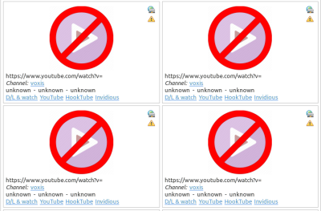

Tartube can merge a video and audio file together, long after they have been downloaded - see `6.25 More information about FFmpeg and AVConv`_.

7.15 Too many folders in the main window
----------------------------------------

*Q: The main window is full of folders I never use! I can't see my own channels, playlists and folders!*

A: In the main window's toolbar, click the **Hide (most) system folders** button (a red folder)

A: In the main menu, click **Media > Hide (most) system folders**

A: Right-click the folders you don't want to see, and select **Folder actions > Hide folder**. To reverse this step, in the main menu click **Media > Show hidden folders**

A: In the main menu, click **Edit > System preferences... > Windows > Videos**, and click **Show smaller icons in the Video Index** to select it

A: If you have many channels and playlists, create a folder, and then drag-and-drop some channels/playlists into it

7.16 Not enough videos in the main window
-----------------------------------------

*Q: I want to see all the videos on a single page, not spread over several pages!*

A: At the bottom of the **Tartube** window, set the page size to zero, and press **ENTER**.

7.17 Toolbar is too small
-------------------------

*Q: The toolbar is too small! There isn't enough room for all the buttons!*

A: Click **Edit > System preferences... > Windows > Main window** and then click **Don't show labels in the main window toolbar** to select it.

MS Windows users can already see a toolbar without labels.

7.18 Toolbar is too big
-----------------------

*Q: The toolbar is too big! Make it go away!*

A: Click **Edit > System preferences... > Windows > Main window**, and then click **Don't show the main window toolbar**. The new setting is applied when you restart **Tartube**.

7.19 YouTube name/password not accepted
---------------------------------------

*Q: I added my YouTube username and password, but I am still seeing authentification errors!*

A: The questioner is talking about the settings in **Edit > General download options... > Advanced**.

This is a **youtube-dl** issue. A general solution is described in `this post <https://github.com/ytdl-org/youtube-dl/issues/21313#issuecomment-499496235>`__.

The solution describes how to create a cookies.txt file, which can be specified as a download option.

Having created the file, in the same edit window, click the **General** tab. In the box labelled **Extra command line options**, you can add:

**--cookies=YT-cookies.txt**

See also the **Tartube** thread `here <https://github.com/axcore/tartube/issues/68>`__.

7.20 Georestriction workarounds don't work
------------------------------------------

*Q: I want to download a video, but it's blocked in my region. I set the geostriction workarounds, but I still can't download the video!*

A: **youtube-dl** provides some options for bypassing region-blocking. To show them, click **Edit > General download options...**, then click the **Show advanced download options** button if it's visible, then click the tabs **Advanced > Geo-restriction**.

Unfortunately, although these options exist, websites are not compelled to respect them. **YouTube**, in particular, may completely ignore them.

In many cases, the only remedy is to buy a subscription to a `VPN <https://en.wikipedia.org/wiki/Virtual_private_network>`__.

7.21 Video website blocks me
----------------------------

*Q: I downloaded some videos from a channel, but then YouTube blocked me, and I can't download the rest of them!*

A: Change your IP address and try again.

A: Subscribe to a `VPN <https://en.wikipedia.org/wiki/Virtual_private_network>`__.

A: You can specify a list of proxies (**Edit > System preferences... > Operations > Proxies**). During a download operation, **Tartube** will cycle between these proxies.

Unfortunately, it is not possible to switch between proxies while downloading a channel (youtube-dl does not offer that functionality). But the proxy list will work well if you're trying to download ten different channels.

7.22 MS Windows installer is too big
------------------------------------

*Q: Why is the Windows installer so big?*

A: **Tartube** is a Linux application. The installer for MS Windows contains not just **Tartube** itself, but a copy of Python and a whole bunch of essential graphics libraries, all of them ported to MS Windows.

If you're at all suspicious that such a small application uses such a large installer, you are invited to examine the installed files for yourself:

**C:\\Users\\YOURNAME\\AppData\\Local\\Tartube**

(You might need to enable hidden folders; this can be done from the Control Panel.)

Everything is copied into this single folder. The installer doesn't modify the Windows registry, nor does it install files anywhere else (other than to the desktop and the Start Menu).

The NSIS scripts used to create the installers can be found here:

**C:\\Users\\YOURNAME\\AppData\\Local\\Tartube\\msys64\\home\\user\\tartube\\nsis**

The scripts contain full instructions, so you should be able to create your own installer, which can be compared with the official one.

7.23 Doesn't work on 32-bit Windows
-----------------------------------

*Q: Tartube does not install/work on 32-bit Windows*

A: Cygwin and MSYS2 have `dropped support for 32-bit Windows <https://www.msys2.org/news/#2020-05-17-32-bit-msys2-no-longer-actively-supported>`__. This means that some Tartube features do not work on 32-bit systems and, at some point, Tartube will no longer be supported on 32-bit systems as well.

7.24 Tartube can't detect livestreams
-------------------------------------

*Q: Tartube can't detect upcoming livestreams at all!*

A: Click **Edit > System preferences... General > Modules**.

If the `Python feedparser module <https://pypi.org/project/feedparser/>`__ is not available, you can install it via PyPI. On Linux/BSD, the command to use is something like:

**pip3 install feedparser**

The Tartube installer for 64-bit MS Windows already contains a copy of **feedparser**, so there is no need to install it again. At the time of writing, **Tartube** cannot detect livestreams on 32-bit MS Windows.

7.25 Livestream is already finished
-----------------------------------

*Q: Tartube is showing a livestream that finished hours/days/centuries ago!*

A: Right-click the video and select **Livestream > Not a livestream**.

7.26 Can't hear livestream alarms
---------------------------------

*Q: I set an alarm for an upcoming livestream, but I didn't hear anything!*

A: Obviously you have already checked that your speakers are turned on, so now click **Edit > System preferences... > General > Modules**.

If the `Python playsound module <https://pypi.org/project/playsound/>`__ is not available, you can install it via PyPI. On Linux/BSD, the command to use is something like:

**pip3 install playsound**

The Tartube installer for 64-bit MS Windows already contains a copy of **playsound**, so there is no need to install it again. At the time of writing, **playsound** cannot ne installed on 32-bit MS Windows.

7.27 Some icons not visible
---------------------------

*Q: Icons in the Videos tab are broken! They all look the same!*

*Q: Icons in the Classic Mode tab are broken! They all look the same!*

A: Since v2.4, **Tartube** uses a set of custom icons, replacing system (stock) icons. This was because some users were complaining that their (broken) systems didn't provide the stock icons.

If you want to restore stock icons, click **Edit > System preferences... > Windows > Main window** and then click **Replace stock icons with custom icons (in case stock icons are not visible)** to deselect it. Click the **OK** button to close the window, then restart **Tartube**.

7.28 Video thumbnails not visible
---------------------------------

*Q: Tartube doesn't download video thumbnails any more! It used to work fine!*

A: In June 2020, **YouTube** changed its image format from **.jpg** to **.webp**. Unfortunately, most software (including the graphics libraries used by **Tartube**) don't support **.webp** images yet. Worse still, **YouTube** begain sending **.webp** thumbnails mislabelled as **.jpg**.

In September 2020, **Tartube** and **youtube-dl** added separate fixes for this problem. These fixes both depend on `FFmpeg <https://ffmpeg.org/>`__, so they won't work if FFmpeg is not installed on your system - see `6.4 Installing FFmpeg / AVConv`_.

If you have already downloaded a lot of **.webp** images, you can ask **Tartube** to convert them back to **.jpg**. Once converted, they will be visible in the main window.

* Click **Operations > Tidy up files...**
* In the dialogue window, click **Convert .webp files to .jpg using FFmpeg** to select it, then click the **OK** button

7.29 Video text not visible
---------------------------

*Q: I can't see the text below each video!*

A: If the background colours in the Video Catalogue are getting in the way, you can change them: click **Edit > Sysem preferences... > Windows > Colours**.

7.30 Graphs not visible
-----------------------

*Q: My buddy installed Tartube, and he showed me some download history graphs. But when I looked for that on my computer, I couldn't find them!*

A: Tartube shows download statistics in a number of places, for example **Edit > System preferences... > Files > History**.

The graphs are created by `matplotlib <https://matplotlib.org/>`__, but none of the Tartube installers use it. If you want graphs, you have to install matplotlib yourself.

On Linux/BSD, use your system's software manager. On MS Windows, run the application **C:\Users\YOURNAME\AppData\Local\Tartube\msys64\mingw64.exe**, and in the new window type **pacman -S mingw-w64-x86_64-python-matplotlib**.

7.31 Tartube is not visible in the system tray
----------------------------------------------

*Q: Tartube is not visible in the system tray! There is just an empty space where the Tartube icon should be!*

A: This problem exists on certain Linux desktop environments (e.g. `Cinnamon <https://github.com/linuxmint/Cinnamon>`__) which have still not fixed an ancient bug. The bug is related to a message you might be able to see in a terminal window, *gdk_window_thaw_toplevel_updates: assertion 'window->update_and_descendants_freeze_count > 0' failed*.

Other desktop environments (e.g. `MATE <https://mate-desktop.org/>`__) display the **Tartube** icon correctly.

7.32 Tartube is not portable
----------------------------

*Q: I want to install Tartube on a USB stick. How do I make Tartube portable?*

A: On MS Windows, download the portable edition rather than the usual installer - see `5.1 Installation - MS Windows`_.

A: On other operating systems, just download the source code and run it. Installation is not necessary (as long as you have installed the correct dependencies) - see `5.3.10 Run without installing`_.

**Tartube** looks for a configuration file in two places: firstly, the directory (folder) containing the source code (the one that contains a **setup.py** file), and then, the default location for the system.

If it doesn't find a configuration file in either location, it creates one in the default location for your system.

However, you can create an empty **settings.json** file in the source code directory. If **Tartube** sees that empty file, it starts writing config files to that location, rather than to the default location. The source code directory is now truly portable, since when you move it somewhere, its configuration file moves with it.

You can see both locations by clicking **Edit > System preferences... > Files > Config**.

7.33 Run out of disk space
--------------------------

*Q: When I try to download videos, Tartube refuses, complaining "You have only X / Y Mb remaining on your device". But I'm using an external hard drive with over a trillion terabytes of empty space!*

A: Some users have reported that, when using a virtual machine (e.g. `VirtualBox <https://www.virtualbox.org/>`__), and when downloading videos to a separate filesystem (e.g. an external hard drive), Tartube checks the size of the virtual filesystem instead of the external drive.

This seems to be an issue with the virtualisation software itself (we have confirmed that everything works as expected on a non-virtual system).

The only thing that can be done is to disable the checks and warnings altogether. Click **Edit > System preferences > Files > Device**, and deselect both **Warn user if disk space is less than** and **Halt downloads if disk space is less than**.

7.34 British spelling
---------------------

*Q: These British spellings are getting on my nerves!*

A: Click **Edit > System preferences... > General > Language**, then click the drop-down box to select American English, and then restart **Tartube**

7.35 No puedo hablar inglés
---------------------------

*Q: ¡No puedo usar YouTube porque no hablo inglés!*

A: Necesitamos más traductores.

If you would like to contribute a translation of this project, please read `this document <docs/translate.rst>`__.

8 Contributing
==============

Report a bug: Use the Github `issues <https://github.com/axcore/tartube/issues>`__ page

9 Authors
=========

See the `AUTHORS <AUTHORS>`__ file.

10 License
==========

**Tartube** is licensed under the `GNU General Public License v3.0 <https://www.gnu.org/licenses/gpl-3.0.en.html>`__.

✨🍰✨
