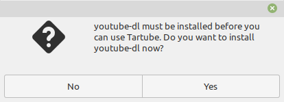
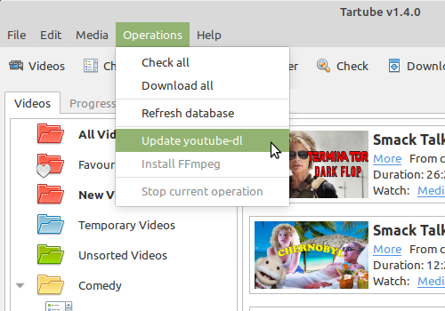
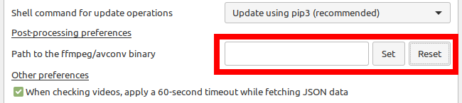

===================================================
Tartube - The Easy Way To Watch And Download Videos
===================================================
------------------------------------------------------------
Works with YouTube, BitChute, and hundreds of other websites
------------------------------------------------------------

.. image:: screenshots/tartube.png
  :alt: Tartube screenshot

* `1 Introduction`_
* `2 Why should I use Tartube?`_
* `3 Downloads`_
* `4 Quick start guide`_
* `5 Installation`_
* `6 Getting started`_
* `7. Frequently-Asked Questions`_
* `8. Contributing`_
* `9. Authors`_
* `10. License`_

1 Introduction
==============

**Tartube** is a GUI front-end for `youtube-dl <https://youtube-dl.org/>`__, partly based on `youtube-dl-gui <https://mrs0m30n3.github.io/youtube-dl-gui/>`__ and written in Python 3 / Gtk 3.

It runs on MS Windows, Linux and BSD. It probably works on MacOS, but the authors have not been able to confirm this.

**Tartube** is beta software. **Test it carefully before you allow it to use your 100TB hard drive**, as it might not behave in the way you're expecting. 

Problems can be reported at `our GitHub page <https://github.com/axcore/tartube/issues>`__.

2 Why should I use Tartube?
===========================

-  You can download individual videos, and even whole channels and playlists, from YouTube and hundreds of other sites (see `here <https://ytdl-org.github.io/youtube-dl/supportedsites.html>`__ for a full list)
-  You can fetch information about those videos, channels and playlists, without actually downloading anything
-  **Tartube** will organise your videos into convenient folders
-  If creators upload their videos to more than one website (**YouTube** and **BitChute**, for example), you can download videos from both sites without creating duplicates
-  Certain popular websites manipulate search results, repeatedly unsubscribe people from their favourite channels and/or deliberately conceal videos that they don't like. **Tartube** won't do any of those things
-  **Tartube** can, in some circumstances, see videos that are region-blocked and/or age-restricted
-  **Tartube** is free and open-source software

3 Downloads
===========

Latest version: **v1.4.0 (2 Feb 2019)**

-  `MS Windows (32-bit) installer <https://sourceforge.net/projects/tartube/files/v1.4.0/install-tartube-1.4.0-32bit.exe/download>`__ from Sourceforge
-  `MS Windows (64-bit) installer <https://sourceforge.net/projects/tartube/files/v1.4.0/install-tartube-1.4.0-64bit.exe/download>`__ from Sourceforge
-  `Source code <https://sourceforge.net/projects/tartube/files/v1.4.0/tartube_v1.4.0.tar.gz/download>`__ from Sourceforge
-  `Source code <https://github.com/axcore/tartube>`__ and `support <https://github.com/axcore/tartube/issues>`__ from GitHub

4 Quick start guide 
===================

4.1 MS Windows
--------------

-  Download, install and run Tartube
-  When prompted, choose a folder where **Tartube** can store videos
-  When prompted, let **Tartube** install **youtube-dl** for you
-  It's recommended that you install **FFmeg**. From the menu, click **Operations > Install FFmpeg**
-  Go to the YouTube website, and find your favourite channel
-  In Tartube, click the **Add a new channel** button (or from the menu, click **Media > Add channel...** )
-  In the dialogue window, add the name of the channel and the address (URL)
-  Click the **OK** button to close the window
-  Click the **Check all** button. **Tartube** will fetch a list of videos in the channel
-  Click **All Videos** to see that list
-  If you want to download the videos, click the **Download all** button

4.2 Linux/BSD
~~~~~~~~~~~~~

-  Download and install `youtube-dl <https://youtube-dl.org/>`__
-  It's recommended that you install  `Ffmpeg <https://ffmpeg.org/>`__ or `AVConv <https://sourceforge.io/projects/avconv/>`__, too
-  Download Tartube. Installation is not necessary; you can just run the main script (navigate into the **Tartube** directory, open a terminal window, and type **python3 tartube/tartube**)
-  When prompted, choose a directory where **Tartube** can store videos
-  Go to the YouTube website, and find your favourite channel
-  In Tartube, click the **Add a new channel** button (or from the menu, click **Media > Add channel...** )
-  In the dialogue window, add the name of the channel and the address (URL)
-  Click the **OK** button to close the window
-  Click the **Check all** button. **Tartube** will fetch a list of videos in the channel
-  Click **All Videos** to see that list
-  If you want to download the videos, click the **Download all** button

5 Installation
==============

5.1 Installation - MS Windows
-----------------------------

MS Windows users should use the installer `available at the Tartube website <https://tartube.sourceforge.io/>`__. The installer contains everything you need to run Tartube. You must be using Windows Vista or above; the installer will not work on Windows XP.

If you want to use **FFmpeg**, see `6.4 Setting the location of FFmpeg / AVConv`_. 

From v1.4, the installer includes a copy of `AtomicParsley <https://bitbucket.org/jonhedgerows/atomicparsley/wiki/Home>`__, so there is no need to install it yourself.

5.1.1 Manual installation - MS Windows
~~~~~~~~~~~~~~~~~~~~~~~~~~~~~~~~~~~~~~

Some users report that Tartube will install but won't run. This problem should be fixed as of v1.2.0 but, if you still have problems, you can try performing a manual installation. This takes about 10-30 minutes, depending on your internet speed.

- This section assumes you have a 64-bit computer
- Download and install MSYS2 from `msys2.org <https://msys2.org>`__. You need the file that looks something like **msys2-x86_64-yyyymmdd.exe**
- MSYS2 wants to install in **C:\\msys64**, so do that
- Open the MINGW64 terminal, which is **C:\\msys64\\mingw64.exe**
- In the MINGW64 terminal, type:

        **pacman -Syu**
        
- If the terminal wants to shut down, close it, and then restart it
- Now type the following commands, one by one:

        **pacman -Su**
        
        **pacman -S mingw-w64-x86_64-python3**
        
        **pacman -S mingw-w64-x86_64-python3-pip**
        
        **pacman -S mingw-w64-x86_64-python3-gobject**
        
        **pacman -S mingw-w64-x86_64-python3-requests**
        
        **pacman -S mingw-w64-x86_64-gtk3**
        
        **pacman -S mingw-w64-x86_64-gsettings-desktop-schemas**        
        
- Download the Tartube source code from Sourceforge, using the links above
- Extract it into the folder **C:\\msys64\\home\\YOURNAME**, creating a folder called **C:\\msys64\\home\\YOURNAME\\tartube**
- Now, to run Tartube, type these commands in the MINGW64 terminal:

        **cd tartube**
        
        **python3 tartube**

5.2 Installation - MacOS
------------------------

Tartube should run on MacOS, but the authors don't have access a MacOS system. If you are a MacOS user, open an issue at our Github page, and we'll work out the installation procedure together.

5.3 Installation - Linux/BSD
----------------------------

Linux/BSD users can use any of the following installation methods.

5.3.1 Linux/BSD Installation requirements
~~~~~~~~~~~~~~~~~~~~~~~~~~~~~~~~~~~~~~~~~

-  `youtube-dl <https://youtube-dl.org/>`__
-  `Python 3 <https://www.python.org/downloads>`__
-  `Gtk 3 <https://python-gtk-3-tutorial.readthedocs.io/en/latest/>`__
-  `Python Requests module <https://3.python-requests.org/>`__

5.3.2 Optional dependencies
~~~~~~~~~~~~~~~~~~~~~~~~~~~

-  `Python xdg module <https://pypi.org/project/xdg/>`__ - required if you want to package **Tartube**
-  `Python pip <https://pypi.org/project/pip/>`__ - keeping youtube-dl up to date is much simpler when pip is installed
-  `Python moviepy module <https://pypi.org/project/moviepy/>`__ - if the website doesn't tell Tartube about the length of its videos, moviepy can work it out
-  `Ffmpeg <https://ffmpeg.org/>`__ or `AVConv <https://sourceforge.io/projects/avconv/>`__ - required for various video post-processing tasks; see the section below if you want to use FFmpeg or AVConv
-  `AtomicParsley <https://bitbucket.org/wez/atomicparsley/src/default/>`__ - required for embedding thumbnails in audio files

5.3.3 Install using PyPI
~~~~~~~~~~~~~~~~~~~~~~~~

Installation via ``pip`` does not work. I have given up trying to make it work.

5.3.4 Install from source
~~~~~~~~~~~~~~~~~~~~~~~~~

1. Download & extract the source
2. Change directory into the **Tartube** directory
3. Type: ``python3 setup.py install``
4. Type: ``tartube``

5.3.5 Run without installing
~~~~~~~~~~~~~~~~~~~~~~~~~~~~

1. Download & extract the source
2. Change directory into the **Tartube** directory
3. The executable is inside a further sub-directory, so do **cd tartube** again
4. Type: ``python3 tartube``

6 Getting started
=================

6.1 Choose where to save videos
-------------------------------

When you first start **Tartube**, you will be asked to choose where Tartube should save its videos.

.. image:: screenshots/example1.png
  :alt: Setting Tartube's data folder

Regardless of which location you select, you can change it later, if you need to.

-  In the main menu, click **File > Change database**
-  In the new window, check the location of the **Tartube data directory**
-  If you want to change it, click the **Change** button

6.2 Check youtube-dl is updated
-------------------------------

*This section does not apply if you installed Tartube via the Debian repository.*

**Tartube** uses **youtube-dl** to interact with websites like YouTube. You should check that **youtube-dl** is also installed and running correctly.

If you are using MS Windows, you will be prompted to install **youtube-dl**; you should click **Yes**.

  
**youtube-dl** is updated every week or so. You can check that **youtube-dl** is installed and up to date:

-  Click **Operations > Update youtube-dl**

6.3 Setting youtube-dl's location
---------------------------------

*This section does not apply if you installed Tartube via the Debian repository.*

If the update operation fails on MS Windows, you should `ask the authors for help <https://github.com/axcore/tartube/>`__.

On other systems, users can modify Tartube's settings. There are several locations on your filesystem where **youtube-dl** might have been installed. 

.. image:: screenshots/example2.png
  :alt: Updating youtube-dl

-  Click **Edit > System preferences... > youtube-dl**
-  Try changing the setting **Actual path to use**
-  Try changing the setting **Shell command for update operations**
-  Try the update operation again

6.4 Setting the location of FFmpeg / AVConv
-------------------------------------------
  
**youtube-dl** can use the `FFmpeg library <https://ffmpeg.org/>`__ or the `AVConv library <https://sourceforge.io/projects/avconv/>`__ for various video-processing tasks, such as converting video files to audio, and for handling large resolutions (1080p and higher). If you want to use FFmpeg or AVConv, you should first install them on your system.

6.4.1 On MS Windows
~~~~~~~~~~~~~~~~~~~

On MS Windows, the usual methods of FFmpeg installation will not work. You **must** download a MinGW-compatible version of FFmpeg. The quickest way to do this is from **Tartube**'s main menu: click **Operations > Install FFmpeg**.

There is no known method of installing a compatible version of AVConv.

6.4.2 On Linux/BSD
~~~~~~~~~~~~~~~~~~

On Linux/BSD, **youtube-dl** might be able to detect FFmpeg/AVConv without any help from you. If not, you can tell Tartube where to find FFmpeg/AVConv in this same tab.

6.5 Introducing system folders
------------------------------

On the left side of the **Tartube** window is a list of folders. You can store videos, channels and playlists inside these folders. You can even store folders inside of other folders.

**Tartube** saves videos on your filesystem using exactly the same structure.

.. image:: screenshots/example3.png
  :alt: Tartube's system folders
  
When you start **Tartube**, there are five folders already visible. You can't remove any of these folders (but you can hide them, if you want).

Videos saved to the **Temporary Videos** folder are deleted when **Tartube** shuts down.

6.6 Adding videos
-----------------

You can add individual videos by clicking the **'Videos'** button near the top of the window. A dialogue window will appear.

.. image:: screenshots/example4.png
  :alt: Adding videos

Copy and paste the video's URL into the dialogue window. You can copy and paste as many URLs as you like.

When you're finished, click the **OK** button. 

Finally, click on the **Unsorted Videos** folder to see the videos you've added.

.. image:: screenshots/example5.png
  :alt: Your first added video

6.7 Adding channels and playlists
---------------------------------

You can also add a whole channel by clicking the **'Channel'** button or a whole playlist by clicking the **'Playlist'** button. 

**Tartube** will download all of the videos in the channel or playlist.

.. image:: screenshots/example6.png
  :alt: Adding a channel

Copy and paste the channel's URL into the dialogue window. You should also give the channel a name. The channel's name is usually the name used on the website (but you can choose any name you like).

6.8 Adding videos, channels and playlists together
--------------------------------------------------

When adding a long list of URLs, containing a mixture of channels, playlists and individual videos, it's quicker to add them all at the same time. Click the **'Videos'** button near the top of the window, and paste all the links into the dialogue window.

**Tartube** doesn't know anything about these links until you actually download them (or check them). If it's expecting an individual video, but receives a channel or a playlist, **Tartube** will the handle the conversion for you.

By default, **Tartube** converts a link into a channel, when necessary. You can change this behaviour, if you want to.

- In **Tartube**'s main window, click **Edit > System preferences... > Operations > URL flexibility**
- Select one of the behaviours listed here

Unfortunately, there is no way for **Tartube** to distinguish a channel from a playlist. Most video websites don't supply that information.

If your list of URLs contains a mixture of channels and playlists, you can convert one to the other after the download has finished.

- In **Tartube**'s main window, right-click a channel, and select **Channel actions > Convert to playlist**
- Alternatively, right-click a playlist, and select **Channel actions > Convert to channel**
- After converting, you can set a name for the new channel/playlist by right-clicking it, and selecting **Filesystem > Rename channel...**

6.9 Adding folders
------------------

The left-hand side of the window will quickly still filling up. It's a good idea to create some folders, and to store your channels/playlists inside those folders.

Click the **'Folder'** button near the top of the window,  and create a folder called **Comedy**. 

.. image:: screenshots/example7.png
  :alt: Adding a folder

Then repeat that process to create a folder called **Music**. You can then drag-and-drop your channels and playlists into those folders.

.. image:: screenshots/example8.png
  :alt: A channel inside a folder

6.10 Things you can do
----------------------

Once you've finished adding videos, channels, playlists and folders, there are basically four things **Tartube** can do:

-  **'Check'** - Fetch information about videos, but don't download them
-  **'Download'** - Actually download the videos. If you have disabled downloads for a particular item, **Tartube** will just fetch information about it instead
-  **'Update'** - Updates youtube-dl, as described above
-  **'Refresh'** - Examines your filesystem. If you have manually copied any videos into **Tartube**'s data directory, those videos are added to
   **Tartube**'s database

.. image:: screenshots/example9.png
  :alt: The Check and Download buttons
  
To **Check** or **Download** videos, channels and playlists, use the buttons near the top of the window. To **Refresh** **Tartube**'s database, use the menu.

**Protip:** Do an **'Update'** operation before you do a **'Check'** or **'Download'** operation

**Protip:** Do a **'Check'** operation before you do **'Refresh'** operation

6.11 General download options
-----------------------------

**youtube-dl** offers a large number of download options. This is how to set them.

.. image:: screenshots/example10.png
  :alt: Opening the download options window
  
-  Click **Edit > General download options...**

A new window opens. Any changes you make in this window aren't actually applied until you click the **'Apply'** or **'OK'** buttons.

6.12 Other download options
---------------------------

Those are the *default* download options. If you want to apply a *different* set of download options to a particular channel or particular playlist, you can do so.

At the moment, the general download options apply to *all* the videos, channels, playlists and folders you've added.

.. image:: screenshots/example11.png
  :alt: The window with only general download options applied
  
Now, suppose you want to apply some download options to the **Music** folder:

-  Right-click the folder, and select **Apply download options...**

In the new window, click the **'OK'** button. The options are applied to *everything* in the **Music folder**. A pen icon appears above the folder to remind you of this.

.. image:: screenshots/example12.png
  :alt: Download options applied to the Music folder

Now, suppose you want to add a *different* set of download options, but only for the **Village People** channel.

-  Right-click the channel, and select **Apply download options...**
-  In the new window, click the **'OK'** button

The previous set of download options still applies to everything in the **Music** folder, *except* the **Village People** channel.

.. image:: screenshots/example13.png
  :alt: Download options applied to the Village People channel

6.13 Favourite videos
---------------------

You can mark channels, playlists and even whole folders as favourites.

-  Right-click the channel, playlist or folder, and select
   **Mark videos > Favourite**

When you do that, any videos you download will appear in the **Favourite Videos** folder (as well as in their normal location).

6.14 Watching videos
--------------------

If you've downloaded a video, you can watch it by clicking the word **Player**.

.. image:: screenshots/example14.png
  :alt: Watching a video

If you haven't downloaded the video yet, you can watch it online by clicking the word **YouTube** or **Website**. (One or the other will be visible).

If it's a YouTube video that is restricted (not available in certain regions, or without confirming your age), it's often possible to watch the same video without restrictions on the **HookTube** website.

6.15 Combining channels, playlists and folders
----------------------------------------------

**Tartube** can download videos from several channels and/or playlists into a single directory (folder) on your computer's hard drive. There are three situations in which this might be useful:

- A channel has several playlists. You have added both the channel and its playlists to Tartube's database, but you don't want to download duplicate videos
- A creator releases their videos on **BitChute** as well as on **YouTube**. You have added both channels, but you don't want to download duplicate videos
- You don't care about keeping videos in separate directories/folders on your filesystem. You just want to download all videos to one place

6.15.1 Combining one channel and many playlists
~~~~~~~~~~~~~~~~~~~~~~~~~~~~~~~~~~~~~~~~~~~~~~~

A creator might have a single channel, and several playlists. The playlists contain videos from that channel (but not necessarily *every* video).

You can add the channel and its playlists in the normal way but, if you do, **Tartube** will download many videos twice.

The solution is to tell **Tartube** to store all the videos from the channel and its playlists in a single location. In that way, you can still see a list of videos in each playlist, but duplicate videos are not actually downloaded to your filesystem.

- Click **Media > Add channel**..., and then enter the channel's details
- Click **Media > Add playlist**... for each playlist
- Now, right-click on each playlist in turn and select **Playlist actions > Set download destination...**
- In the dialogue window, click **Choose a different directory/folder**, select the name of the channel, then click the **OK button**

6.15.2 Combining channels from different websites
~~~~~~~~~~~~~~~~~~~~~~~~~~~~~~~~~~~~~~~~~~~~~~~~~

A creator might release their videos on **YouTube**, but also on a site like **BitChute**. Sometimes they will only release a particular video on **BitChute**.

You can add both channels in the normal way but, if you do, **Tartube** will download many videos twice.

The solution is to tell **Tartube** to store videos from both channels in a single location. In that way, you can still see a list of videos in each channel, but duplicate videos are not actually downloaded to your filesystem.

- Click **Media > Add channel**..., and then enter the **YouTube** channel's details
- Click **Media > Add channel**..., and then enter the **BitChute** channel's details
- Right-click the **BitChute** channel and select **Channel actions > Set download destination...**
- In the dialogue window, click **Choose a different directory/folder**, select the name of the **YouTube** channel, then click the **OK button**

It doesn't matter which of the two channels you use as the download destination. There is also no limit to the number of parallel channels, so if a creator uploads videos to a dozen different websites, you can add them all.

6.15.3 Download all videos to a single folder
~~~~~~~~~~~~~~~~~~~~~~~~~~~~~~~~~~~~~~~~~~~~~

If you don't care about keeping videos in separate directories/folders on your filesystem, you can download *all* videos into the **Unsorted videos** folder. Regardless of whether you have added one channel or a thousand, all the videos will be stored in that one place.

- Click **Edit > General download options... > Files > Filesystem**
- Click the **Download all videos into this folder** button to select it
- In the combo next to it, select **Unsorted Videos**

Alternatively, you could select **Temporary Videos**. If you do, videos will be deleted when you shut down **Tartube** (and will not be re-downloaded in the future).

6.16 Archiving videos
---------------------

You can tell **Tartube** to automatically delete videos after some period of time. This is useful if you don't have an infinitely large hard drive.

- Click **Edit > System preferences... > Filesystem > Video Deletion** 
- Click the **Automatically delete downloaded videos after this many days** button to select it
- If you want to, change the number of days from 30 to some other value

If you want to protect your favourite videos from being deleted automatically, you can *archive* them. Only videos that have actually been downloaded can be archived.

- Right-click a video, and select **Video is archived**

You can also archive all the videos in a channel, playlist or folder. 

- For example, right-click a folder and select **Channel contents > Mark videos as archived**
- This action applies to *all* videos that are *currently* in the folder, including the contents of any channels and playlists in that folder
- It doesn't apply to any videos you might download in the future

6.17 Exporting/importing the Tartube database
---------------------------------------------

You can export the contents of **Tartube**'s database and, at any time in the future, import that information into a different **Tartube** database, perhaps on a different computer.

It is important to note that *only a list of videos, channels, playlists, folders are exported*. The videos themselves are not exported, and neither are any thumbnail, description or metadata files.

- Click **Media > Export from database**
- In the dialogue window, choose what you want to export
- If you want a list of videos, channels and playlists that you can edit by hand, select the **Export as plain text** option
- Click the **OK** button, then select where to save the export file

It is safe to share this export file with other people. It doesn't contain any personal information.

This is how to import the data into a different **Tartube** database.

- Click **Media > Import into database > JSON export file** or **Media > Import into database > Plain text export file**
- Select the export file you created earlier
- A dialogue window will appear. You can choose how much of the database you want to import

6.18 Importing videos from other applications
---------------------------------------------

**Tartube** is a GUI front-end for `youtube-dl <https://youtube-dl.org/>`__, but it is not the only one. If you've downloaded videos using another application, this is how to add them to Tartube's database.

- In **Tartube**'s main window, add each channel and playlist in the normal way
- When you're ready, click the **Check all** button. This adds a list of videos to Tartube's database, without actually downloading the videos themselves
- Copy the video files into Tartube's data folder. For example, copy all your **PewDiePie** videos into **../tartube-data/downloads/PewDiePie**
- In the **Tartube** menu, click **Operations > Refresh database**. **Tartube** will search for video files, and try to match them with the contents of its database
- The whole process might some time, so be patient

6.19 Converting to audio
------------------------

**Tartube** can automatically extract the audio from its downloaded videos, if that's what you want.

The first step is to make sure that either FFmpeg or AVconv is installed on your system - see `6.4 Setting the location of FFmpeg / AVconv`_.

The remaining steps are simple:

- In **Tartube**'s main window, click **Edit > General download options...**

In the new window, if the **Sound only** tab is visible, do this:

- Click the **Sound Only** tab
- Select the checkbox **Download each video, extract the sound, and then discard the original videos**
- In the boxes below, select an audio format and an audio quality
- Click the **OK** button at the bottom of the window to apply your changes

If the **Post-process** tab is visible, do this:

- Click on the **Post-process** tab
- Select the checkbox **Post-process video files to convert them to audio-only files** 
- If you want, click the button **Keep video file after post-processing it** to select it
- In the box labelled **Audio format of the post-processed file**, specify what type of audio file you want - **.mp3**, **.wav**, etc 
- Click the **OK** button at the bottom of the window to apply your changes

7. Frequently-Asked Questions
=============================

**Q: I can't install Tartube / I can't run Tartube / Tartube doesn't work properly / Tartube keeps crashing!**

A: Tartube is beta software. Please report any problems to the authors at our `Github page <https://github.com/axcore/tartube/issues>`__ 

**Q: After I downloaded some videos, Tartube crashed, and now all my videos are missing!**

A: Tartube creates a backup copy of its database, before trying to save a new copy. In the unlikely event of a failure, you can replace the broken database file with the backup file. 

- Open the data directory (folder). If you're not sure where to find Tartube's data directory , you can click **Edit > System preferences... > Filesystem > Database**
- Make sure **Tartube** is not running. The **Tartube** window is sometimes minimised, and sometimes only visible in the system tray. A good way to make sure is to run Tartube, then close it by clicking **File > Quit**
- In the data directory is the broken **tartube.db** file. You should rename to something else, in case you want to examine it later
- In the same directory, you might be able to see a directory called **.backups**
- If **.backups** is not visible, then it is hidden. (On many Linux/BSD system, pressing **CTRL + H** will reveal hidden folders)
- Inside the **.backups** directory, you'll find some backup copies of the database file
- Choose the most recent one, copy it into the directory above, and rename the copy as **tartube.db**, replacing the old broken file
- Restart **Tartube**
- Click the **Check All** button. **Tartube** will update its database with any videos you've downloaded that were not in the backup database file

Tartube can make more frequent backups of your database file, if you want. See the options in **Edit > System preferences... > Filesystem > Backups**.

Note that Tartube does not create backup copies of the videos you've downloaded. That is your responsibility!

**Q: I clicked the 'Check all' button, but the operation takes so long! It only found two new videos!**

A: By default, the underlying **youtube-dl** software checks an entire channel, even if it contains hundreds of videos. 

You can drastically reduce the time this takes by telling Tartube to stop checking/downloading videos, if it receives (for example) notifications for three videos it has already checked/downloaded.

This works well on sites like YouTube, which send information about videos in the order they were uploaded, newest first. We can't guarantee it will work on every site.

- Click **Edit > System preferences... > Operations > Time-saving**
- Select the checkbox **Stop checking/downloading a channel/playlist when it starts sending vidoes we already have**
- In the **Stop after this many videos (when checking)** box, enter the value 3
- In the **Stop after this many videos (when downloading)** box, enter the value 3
- Click **OK** to close the window

**Q: I clicked the 'Download all' button, but the operation takes so long! It only downloaded two new videos!**

A: **youtube-dl** can create an archive file especially for the purpose of speeding up downloads, when some of your channels and playlists have no new videos to download, but when others do. 

To enable this functionality, click **Edit > System preferences... > youtube-dl > Allow youtube-dl to create its own archive**. The functionality is enabled by default.

**Q: Tartube always downloads its channels and playlists into ../tartube-data/downloads. Why doesn't it just download directly into ../tartube-data?**

A: This was implemented in v1.4.0. If you installed an earlier version of **Tartube**, you don't need to take any action; **Tartube** can cope with both the old and new file structures.

If you installed an earlier version of **Tartube**, and if you want to move your channels and playlists out of **../tartube-data/downloads**, this is how to do it:

- Open the data directory (folder). If you're not sure where to find Tartube's data directory, you can click **Edit > System preferences... > Filesystem > Database**.
- Make sure **Tartube** is not running. The **Tartube** window is sometimes minimised, and sometimes only visible in the system tray. A good way to make sure is to run **Tartube**, then close it by clicking **File > Quit**
- Now open the **downloads** directory
- Move everything inside that directory into the directory above, e.g. move everything from **../tartube-data/downloads** into **../tartube-data**
- Delete the empty **downloads** directory
- You can now restart **Tartube**

**Q: I want to convert the video files to audio files!**

A: See `6.19 Converting to audio`_

**Q: I want to see all the videos on a single page, not spread over several pages!**

A: At the bottom of the Tartube window, set the page size to zero, and press **ENTER**.

**Q: The toolbar is too small! There isn't enough room for all the buttons!**

A: Click **Edit > System preferences... > Windows > Main window > Don't show labels in the toolbar**.

MS Windows users can already see a toolbar without labels.

**Q: Why is the Windows installer so big?**

Tartube is a Linux application. The installer for MS Windows contains not just Tartube itself, but a copy of Python and a whole bunch of essential graphics libraries, all of them ported to MS Windows.

If you're at all suspicious that such a small application uses such a large installer, you are invited to examine the installed files for yourself: 

**C:\\Users\\YOURNAME\\AppData\\Local\\Tartube**

(You might need to enable hidden folders; this can be done from the Control Panel.)

Everything is copied into this single folder. The installer doesn't modify the Windows registry, nor does it copy files anywhere else (other than to the desktop and the Start Menu). 

The NSIS scripts used to create the installers can be found here:

**C:\\Users\\YOURNAME\\AppData\\Local\\Tartube\\msys64\\home\\user\\tartube\\nsis**

The scripts contain full instructions, so you should be able to create your own installer, and compare it with the official one.

8. Contributing
===============

-  Report a bug: Use the Github
   `issues <https://github.com/axcore/tartube/issues>`__ page

9. Authors
==========

See the `AUTHORS <AUTHORS>`__ file.

10. License
===========

Tartube is licensed under the `GNU General Public License v3.0 <https://www.gnu.org/licenses/gpl-3.0.en.html>`__.

✨🍰✨
