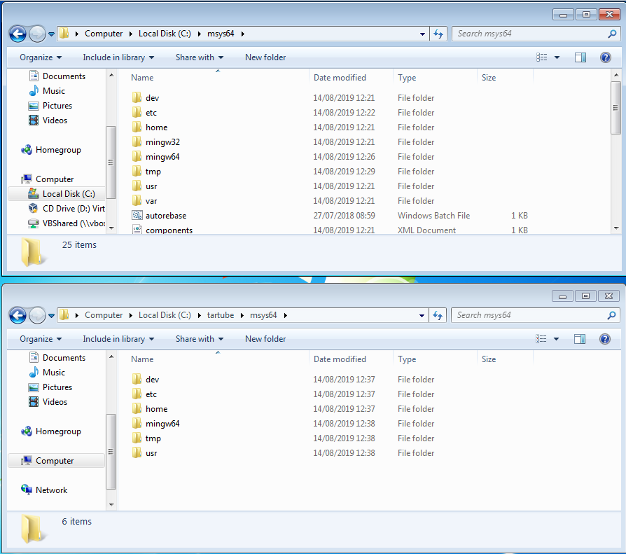

Tartube installation problems on MS Windows
===========================================

Some users on MS Windows report that they can't run Tartube at all. 

This page describes what you can do, if you are one of them.

The problem
~~~~~~~~~~~

A full installation of Tartube and all of its dependencies uses over 2GB of your hard drive. The download is over 600MB.

This is obviously too much, so I've removed everything that is not necessary. As a result, the installer is a 90MB download.

The installer works for most people, but some users are reporting that they can't run Tartube at all. 

Obviously, something is missing from the installer. I can't reproduce the problem on any computer, so I don't know what is missing.

The solution
~~~~~~~~~~~~

A workaround is to perform a manual installation. This takes about 10-30 minutes, depending on your internet speed.

If the manual installation works, you can try to diagnose the original problem. 

As soon as someone discovers what is missing from the installer, I can add it, and everyone will be happy again.

MS Windows manual installation
~~~~~~~~~~~~~~~~~~~~~~~~~~~~~~

- This section assumes you have a 64-bit computer
- Download and install MSYS2 from `msys2.org <https://msys2.org>`__. You need the file that looks something like **msys2-x86_64-yyyymmdd.exe**
- MSYS2 wants to install in **C:\\msys64**, so do that
- Open the MINGW64 terminal, which is **C:\\msys64\\mingw64.exe**
- In the MINGW64 terminal, type:

        **pacman -Syu**
        
- If the terminal wants to shut down, close it, and then restart it
- Now type the following commands, one by one:

        **pacman -Su**
        
        **pacman -S mingw-w64-x86_64-python3**
        
        **pacman -S mingw-w64-x86_64-python3-pip**
        
        **pacman -S mingw-w64-x86_64-python3-gobject**
        
        **pacman -S mingw-w64-x86_64-python3-requests**
        
        **pacman -S mingw-w64-x86_64-gtk3**
        
        **pacman -S mingw-w64-x86_64-gsettings-desktop-schemas**        
        
- Download the `Tartube source code <https://sourceforge.net/projects/tartube/files/v0.7.0/tartube_v0.7.0.tar.gz/download>`__ from Sourceforge
- Extract it into the folder **C:\\msys64\\home\\YOURNAME**, creating a folder called **C:\\msys64\\home\\YOURNAME\\tartube**
- Now, to run Tartube, type these commands in the MINGW64 terminal:

        **cd tartube**
        
        **python3 tartube**

Diagnosing the problem
----------------------

If the manual installation works, and if you have the time and the patience, you can work out what the missing dependency is. When you find it, please `tell me <https://github.com/axcore/tartube/issues>`__.

- Download the normal installer from `Sourceforge <https://tartube.sourceforge.io/>`__
- Run the installer. Tell it to install Tartube in **C:\\tartube**
 

  
- You now have two installations - a working one in **C:\\msys64\\**, and a broken one in **C:\\tartube\\msys64\\**

  
- Now, you can start moving files and folders from the working folder into the broken folder, **one at a time**
- For example, you could move the file **C:\\msys64\\usr\\bin\\awk** to **C:\\tartube\\msys64\\usr\\bin\\awk**
- For example, you could move the folder **C:\\msys64\\usr\\etc** to **C:\\tartube\\msys64\\usr\\bin\\etc**
- Every time you copy something, try to run Tartube (from the Start menu, or from the desktop shortcut)
- When Tartube runs for the first time, `tell me which file/folder you moved <https://github.com/axcore/tartube/issues>`__. I don't need to know everything - just tell me the **last** thing you moved.

